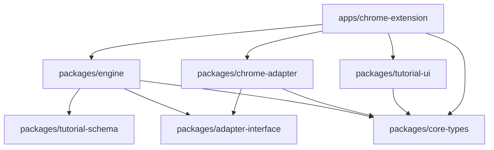
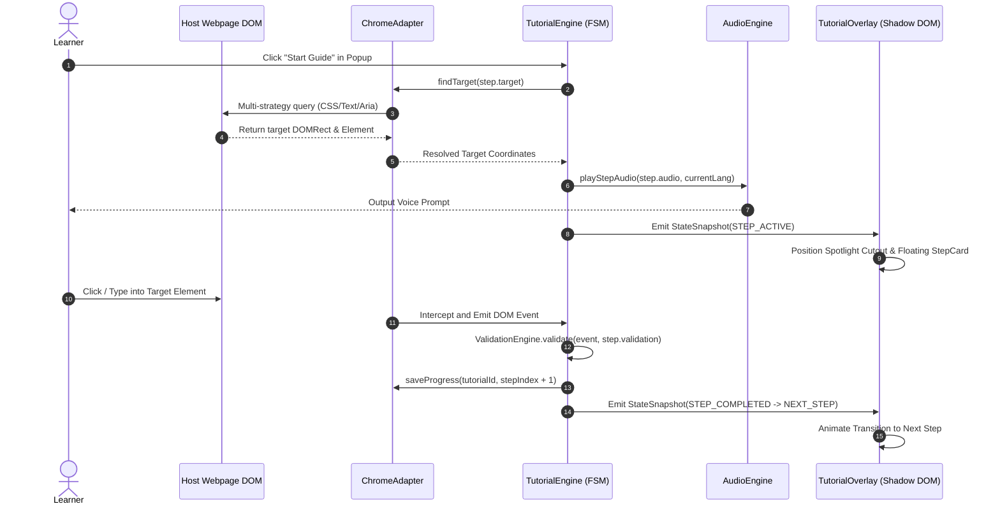

# GuideMe — Tech Stack & System Architecture

> Complete technical breakdown of the GuideMe Universal Tutorial Engine monorepo.

---

## Table of Contents

1. [Project Overview](#1-project-overview)
2. [Tech Stack Summary](#2-tech-stack-summary)
3. [Detailed Tech Stack](#3-detailed-tech-stack)
4. [Monorepo Structure](#4-monorepo-structure)
5. [System Architecture — 7 Layers](#5-system-architecture--7-layers)
6. [Package Dependency Graph](#6-package-dependency-graph)
7. [Data Flow](#7-data-flow)
8. [Core Data Entities](#8-core-data-entities)
9. [Storage Model](#9-storage-model)
10. [Extension Architecture](#10-extension-architecture)
11. [UI Architecture](#11-ui-architecture)
12. [Engine Architecture](#12-engine-architecture)
13. [Adapter Pattern](#13-adapter-pattern)
14. [Styling & Design System](#14-styling--design-system)
15. [Internationalization (i18n)](#15-internationalization-i18n)
16. [Audio System](#16-audio-system)
17. [Testing Strategy](#17-testing-strategy)
18. [Build & Deployment](#18-build--deployment)
19. [Portability Analysis](#19-portability-analysis)

---

## 1. Project Overview

GuideMe is a **Universal Tutorial Engine** that provides interactive step-by-step guidance overlays, SVG spotlights, and dynamic DOM auto-guidance for web applications. It currently ships as a **Chrome Extension (Manifest V3)** built with a decoupled, portable architecture.

| Attribute | Value |
|---|---|
| **Name** | GuideMe: Universal Tutorial Engine |
| **Version** | 1.0.0 |
| **License** | MIT |
| **Type** | Browser Extension + Headless Engine Monorepo |
| **Current Target** | Google Chrome / Chromium (MV3) |
| **Languages** | Khmer (`km`) — primary, English (`en`) — secondary |

---

## 2. Tech Stack Summary

| Layer | Technology | Purpose |
|---|---|---|
| **Monorepo** | PNPM Workspaces | Dependency orchestration across packages |
| **Build System** | WXT (Web Extension Framework) | Manifest V3 build, HMR dev server |
| **Bundler** | Vite (via WXT) | Fast module bundling |
| **UI Framework** | React 18 | Declarative component rendering |
| **Styling** | Tailwind CSS v4 | Utility-first CSS with custom design tokens |
| **Styling Isolation** | Shadow DOM | Complete CSS/DOM encapsulation from host page |
| **Engine Core** | Pure JavaScript (ES Modules) | Headless finite state machine, step resolution |
| **State Management** | Custom Observable Pattern | `subscribe()` + `getStateSnapshot()` |
| **DOM Observation** | MutationObserver, ResizeObserver | Dynamic element polling & viewport tracking |
| **Storage** | `chrome.storage.local` | Durable progress persistence |
| **Messaging** | `chrome.runtime.sendMessage` | Cross-context communication (popup ↔ content ↔ background) |
| **Audio** | Web Audio API / HTML5 Audio | Voice prompt playback |
| **TTS** | Pluggable Provider Interface | Extensible text-to-speech (AI TTS, generic HTTP) |
| **Icons** | React Icons | UI icon library |
| **Testing** | Node.js Test Runner (`node:test`) | Native unit test execution |
| **Language** | ES Modules (`.js`/`.jsx`) | Modern JavaScript modules throughout |

---

## 3. Detailed Tech Stack

### 3.1 Build & Tooling

| Tool | Version | Role |
|---|---|---|
| **PNPM** | Workspace-based | Package manager with workspace protocol (`workspace:*`) |
| **WXT** | Latest | Web Extension framework — handles manifest, content scripts, HMR |
| **Vite** | Via WXT | Bundler and dev server |
| **@vitejs/plugin-react** | Via WXT | React Fast Refresh + JSX transform |
| **PostCSS** | Config present | CSS processing (Tailwind) |
| **esbuild** | Allowlisted | Fast transpilation |

### 3.2 Runtime

| Dependency | Version | Role |
|---|---|---|
| **React** | 18+ | UI component library |
| **react-dom** | 18+ | React DOM renderer |
| **react-icons** | ^5.7.0 | Icon components (Feather icons) |
| **Tailwind CSS** | v4 | Utility-first styling with `@theme` tokens |

### 3.3 Browser APIs Used

| API | Usage |
|---|---|
| `chrome.storage.local` | Persist tutorial progress, theme, language, speaker, history |
| `chrome.storage.onChanged` | Live sync of preferences across contexts |
| `chrome.runtime.sendMessage` | Popup ↔ Content Script ↔ Background messaging |
| `chrome.runtime.onMessage` | Message listeners in all contexts |
| `chrome.tabs.query` | Get active tab info |
| `chrome.tabs.sendMessage` | Popup → Content Script commands |
| `chrome.action.setBadgeText` | Toolbar badge showing step progress |
| `chrome.action.openPopup` | Programmatic popup opening |
| `chrome.scripting.executeScript` | Dynamic content script injection |
| `chrome.windows.create` | Fallback popup window creation |
| **Shadow DOM API** | `createShadowRootUi` — isolated overlay rendering |
| **MutationObserver** | Dynamic DOM element polling |
| **ResizeObserver** | Viewport/element size tracking |
| **Web Audio API** | Audio playback control |
| **SpeechRecognition** | Voice input in popup (via hook) |

---

## 4. Monorepo Structure

```
GuideMe/
├── apps/
│   └── chrome-extension/              # WXT Browser Extension App
│       ├── entrypoints/
│       │   ├── background.js           # Service Worker (badge, message routing)
│       │   ├── content/
│       │   │   ├── index.jsx           # Content Script (Shadow DOM mount)
│       │   │   └── style.css           # Tailwind entry + design tokens
│       │   └── popup/
│       │       ├── App.jsx             # Popup root component
│       │       ├── main.jsx            # Popup entry point
│       │       ├── index.html          # Popup HTML shell
│       │       ├── style.css           # Popup-specific styles
│       │       ├── constants.js        # Storage keys
│       │       ├── hooks/              # Custom hooks (speech recognition)
│       │       └── components/         # Popup-specific components
│       ├── src/
│       │   └── catalog.js              # Pre-built tutorial catalog
│       ├── public/                     # Static assets, test demo
│       ├── wxt.config.js              # WXT configuration (manifest, vite)
│       └── package.json
│
├── packages/
│   ├── core-types/                     # Shared type definitions & enums
│   │   └── src/
│   │       ├── index.js
│   │       ├── ExtensionMessageAction.js
│   │       └── Language.js
│   │
│   ├── adapter-interface/              # Abstract adapter contract
│   │   └── src/
│   │       ├── index.js
│   │       └── base-adapter.js         # BaseTutorialAdapter (abstract)
│   │
│   ├── chrome-adapter/                 # Chrome-specific adapter implementation
│   │   └── src/
│   │       ├── index.js
│   │       ├── chrome-adapter.js       # ChromeAdapter (extends BaseTutorialAdapter)
│   │       ├── dom-observer.js         # MutationObserver element polling
│   │       ├── event-listener.js       # DOM event interception
│   │       ├── url-listener.js         # SPA route change detection
│   │       └── chrome-storage.js       # chrome.storage.local wrapper
│   │
│   ├── tutorial-schema/                # JSON schema validation
│   │   └── src/
│   │       └── index.js
│   │
│   ├── engine/                         # Headless execution engine (pure JS)
│   │   └── src/
│   │       ├── index.js                # Public exports
│   │       ├── engine.js               # TutorialEngine (main orchestrator)
│   │       ├── state-machine/          # FSM (IDLE, STEP_ACTIVE, etc.)
│   │       ├── parser/                 # TutorialParser (JSON validation)
│   │       ├── resolver/               # StepResolver (target resolution)
│   │       ├── validation/             # ValidationEngine (action checking)
│   │       ├── actions/                # ActionEngine (dispatcher)
│   │       ├── runtime/                # EventBus, VariableStore, SessionManager
│   │       ├── dynamic/                # DynamicPageAnalyzer (auto-guide)
│   │       ├── i18n/                   # I18nManager (km/en resolution)
│   │       └── audio/                  # AudioEngine, TTS providers
│   │
│   └── tutorial-ui/                    # Pure presentational UI components
│       └── src/
│           ├── index.js                # Public exports
│           ├── components/
│           │   ├── TutorialOverlay.jsx      # Root overlay orchestrator
│           │   ├── Spotlight.jsx            # SVG cutout + glow ring
│           │   ├── Tooltip.jsx              # Auto-positioning container
│           │   ├── StepCard.jsx             # Frosted glass step card
│           │   ├── ProgressBar.jsx          # Step progress indicator
│           │   ├── FloatingAssistantButton.jsx  # "Ask GuideMe" pill
│           │   ├── FloatingPromptWidget.jsx     # Draggable AI prompt bar
│           │   ├── DashboardOverlay.jsx         # Tutorial catalog view
│           │   ├── OnboardingOverlay.jsx        # First-time onboarding
│           │   ├── LanguageToggle.jsx           # km/en switcher
│           │   └── GuideMeLogo.jsx              # Brand logo
│           └── i18n/
│               └── ui-strings.js        # Centralized bilingual strings
│
├── context/                            # Authoritative architecture docs
├── docs/                               # User-facing documentation
├── tests/                              # Unit test suites
├── pnpm-workspace.yaml                 # PNPM workspace config
├── package.json                        # Root monorepo config
└── jsconfig.json                       # JS path configuration
```

---

## 5. System Architecture — 7 Layers

```
 ┌────────────────────────────────────────────────────────────────────────┐
 │ LAYER 7: AUTHORING SYSTEM (Visual Builder, JSON / DSL Editor, Studio)  │
 │         Future phase — not yet implemented                             │
 └───────────────────────────────────┬────────────────────────────────────┘
                                     │ Generates
                                     ▼
 ┌────────────────────────────────────────────────────────────────────────┐
 │ LAYER 6: TUTORIAL DEFINITION (JSON Schema, Domain Specific Language)   │
 │         Declarative JSON walkthroughs validated by @guideme/tutorial-schema │
 └───────────────────────────────────┬────────────────────────────────────┘
                                     │ Ingests
                                     ▼
 ╔════════════════════════════════════════════════════════════════════════╗
 ║ LAYER 5: ENGINE CORE (Universal Headless Execution Engine)            ║
 ║  • Schema Validator    • Tutorial Parser   • State Machine (FSM)       ║
 ║  • Step Resolver       • Action Engine     • Validation Engine         ║
 ║  Package: @guideme/engine — 100% pure JS, zero DOM/React deps        ║
 ╚═══════════════════════════════════╤════════════════════════════════════╝
                                     │ Coordinates
                                     ▼
 ╔════════════════════════════════════════════════════════════════════════╗
 ║ LAYER 4: RUNTIME SERVICES (In-Memory Engine Context)                  ║
 ║  • Event System        • Variable Store    • Progress Manager          ║
 ║  • I18nManager (km/en) • AudioEngine       • DynamicPageAnalyzer       ║
 ╚═══════════════════════════════════╤════════════════════════════════════╝
                                     │ Dispatches
                                     ▼
 ┌────────────────────────────────────────────────────────────────────────┐
 │ LAYER 3: ADAPTER INTERFACE (`BaseTutorialAdapter` Protocol Contract)   │
 │         Abstract contract — platform-agnostic                          │
 └───────────────────────────────────┬────────────────────────────────────┘
                                     │ Bridges
                                     ▼
 ┌────────────────────────────────────────────────────────────────────────┐
 │ LAYER 2: ENVIRONMENT INTEGRATION (Multi-Target Adapters & Overlays)    │
 │  • ChromeAdapter (MV3 Extension / Content Script / DOM Observer)       │
 │  • React Overlay UI (Isolated Shadow DOM `guideme-tutorial-root`)      │
 │  • SVG Spotlight Cutout & Smart Floating Tooltip                       │
 └───────────────────────────────────┬────────────────────────────────────┘
                                     │ Observes & Interacts
                                     ▼
 ┌────────────────────────────────────────────────────────────────────────┐
 │ LAYER 1: TARGET ENVIRONMENTS (Host Application & System Layers)        │
 │  • Host Web Page DOM (Google Docs, Google Sheets, SaaS Portals, etc.)  │
 └────────────────────────────────────────────────────────────────────────┘
```

---

## 6. Package Dependency Graph



### Dependency Rules (Invariants)

| Package | Depends On | Never Imports |
|---|---|---|
| `@guideme/engine` | `adapter-interface`, `tutorial-schema`, `core-types` | React, Tailwind, Chrome APIs, DOM globals |
| `@guideme/tutorial-ui` | `core-types`, `react-icons` | Chrome APIs, Engine internals |
| `@guideme/chrome-adapter` | `adapter-interface`, `core-types` | React, Engine internals |
| `@guideme/adapter-interface` | Nothing | Everything |
| `@guideme/tutorial-schema` | Nothing | Everything |
| `@guideme/core-types` | Nothing | Everything |

---

## 7. Data Flow

### Step Execution Sequence



### Cross-Context Messaging

```
┌────────────┐     chrome.runtime.sendMessage      ┌──────────────────┐
│   Popup     │ ──────────────────────────────────► │ Background Worker│
│  (App.jsx)  │                                     │ (background.js)  │
└────────────┘                                      └────────┬─────────┘
                                                             │
                                                             │ chrome.tabs.sendMessage
                                                             ▼
                                                    ┌──────────────────┐
                                                    │  Content Script   │
                                                    │ (content/index.jsx)│
                                                    │  Shadow DOM Mount │
                                                    └──────────────────┘
```

---

## 8. Core Data Entities

| Entity | Fields | Description |
|---|---|---|
| **`TutorialDefinition`** | `id`, `name`, `version`, `matchUrls`, `defaultLanguage`, `steps[]` | Root tutorial schema |
| **`StepDefinition`** | `id`, `title`, `instruction`, `target`, `action`, `validation`, `audio` | Single guidance step |
| **`TargetSelector`** | `css`, `text`, `ariaLabel`, `testId`, `timeout` | Multi-strategy target matcher |
| **`ValidationRule`** | `type`, `expectedValue` | User interaction rule (`click`, `input`, `change`, `submit`, `url_change`, `manual_next`) |
| **`AudioPromptConfig`** | `km.audioUrl`, `km.ttsText`, `en.audioUrl`, `en.ttsText`, `autoPlay`, `speechRate` | Localized voice prompt |
| **`EngineStateSnapshot`** | `status`, `tutorialId`, `currentStepIndex`, `currentStep`, `totalSteps`, `language`, `targetRect`, `progress` | Immutable reactive state |

---

## 9. Storage Model

### Durable Storage (`chrome.storage.local`)

| Key | Stores | Lifetime |
|---|---|---|
| `guideme_progress_${tutorialId}_${domain}` | `currentStepIndex`, `completedStepIds`, `completedAt`, `activeLanguage` | Across tab reloads & browser restarts |
| `guideme_theme` | `'light'` or `'dark'` | Permanent |
| `guideme_language` | `'km'` or `'en'` | Permanent |
| `guideme_speaker` | Speaker ID | Permanent |
| `guideme_history` | Array of prompt strings (max 20) | Permanent |
| `guideme_onboarding_done` | Boolean | Permanent |

### Ephemeral (In-Memory)

- Active execution variables
- Transient DOM coordinates
- Dynamic auto-guide step buffers
- Audio playback status

---

## 10. Extension Architecture

### Extension Entry Points

| Entry Point | File | Role |
|---|---|---|
| **Background Service Worker** | `entrypoints/background.js` | Badge updates, message routing between popup ↔ content |
| **Content Script** | `entrypoints/content/index.jsx` | Mounts Shadow DOM UI, instantiates Engine + Adapter, handles runtime messages |
| **Popup** | `entrypoints/popup/App.jsx` | Toolbar popup — chat, settings, tutorial launch, "Extract UI" |

### Extension Permissions (MV3)

| Permission | Purpose |
|---|---|
| `storage` | Persist progress & preferences |
| `tabs` | Query active tab |
| `scripting` | Dynamic content script injection |
| `host_permissions: <all_urls>` | Run on any website |

### Manifest V3 Configuration

```javascript
// wxt.config.js — key manifest settings
{
  manifest: {
    permissions: ['storage', 'tabs', 'scripting'],
    host_permissions: ['*://*/*', '<all_urls>'],
    web_accessible_resources: ['popup.html', 'logo.svg', 'icons/*', 'chunks/*', 'assets/*']
  },
  vite: { plugins: [react()] }
}
```

---

## 11. UI Architecture

### Component Hierarchy

```
TutorialOverlay (Root Shadow DOM Container)
├── Spotlight (Target Glow & Stylized Pointing Hand Cursor)
├── FloatingPromptWidget ("Extract Separate UI" Floating Prompt Bar)
├── FloatingAssistantButton (Black Pill "Ask GuideMe" Floating Button)
└── Tooltip (Auto-Positioned Floating Container)
    └── StepCard (Translucent Dark Frosted Glassmorphic Step Card)
        ├── Top Header (Speaker & Sound Wave Equalizer | Step X/Y + Language Pill + Close)
        ├── Instruction Body (Clean instruction text)
        ├── Action Pill ("Explain detail" / "ពន្យល់លម្អិត" expandable drawer)
        └── Navigation Footer (Progress bar with thumb handle | Back [←], Skip, Next [→])
```

### Component Responsibilities

| Component | Responsibility |
|---|---|
| **`TutorialOverlay`** | Orchestrates spotlight, step card, prompt bar, keybindings |
| **`Spotlight`** | Computes target glowing boundary box, renders pointing hand cursor |
| **`StepCard`** | Frosted glass step card with audio controls, progress, navigation |
| **`Tooltip`** | Auto-positioning container with viewport collision avoidance |
| **`FloatingPromptWidget`** | Draggable AI prompt bar for guidance queries |
| **`FloatingAssistantButton`** | Bottom-right pill button to open prompt / context menu |
| **`DashboardOverlay`** | Tutorial catalog browser with categories |
| **`OnboardingOverlay`** | First-time user onboarding flow |
| **`LanguageToggle`** | Khmer/English switcher |
| **`ProgressBar`** | Step progress indicator with thumb handle |

### UI Mounting (Shadow DOM)

```javascript
// Content script mounts UI inside isolated Shadow DOM
const ui = await createShadowRootUi(ctx, {
  name: 'guideme-tutorial-root',
  position: 'overlay',
  anchor: 'body',
  zIndex: 2147483647,  // Highest 32-bit integer
  onMount(uiContainer) {
    const root = ReactDOM.createRoot(uiContainer);
    root.render(<TutorialApp />);
    return root;
  },
});
```

---

## 12. Engine Architecture

### Engine Package Structure (`@guideme/engine`)

```
engine/src/
├── engine.js               # TutorialEngine — main orchestrator
├── state-machine/
│   └── state-machine.js    # Finite State Machine
├── parser/
│   └── parser.js           # TutorialParser — JSON validation
├── resolver/
│   └── step-resolver.js    # StepResolver — target resolution
├── validation/
│   └── validation-engine.js # ValidationEngine — action checking
├── actions/
│   └── action-engine.js    # ActionEngine — dispatcher
├── runtime/
│   ├── event-bus.js        # Event system
│   ├── variable-store.js   # In-memory variables
│   └── session-manager.js  # Session lifecycle
├── dynamic/
│   └── dynamic-analyzer.js # DynamicPageAnalyzer — auto-guide
├── i18n/
│   └── i18n-manager.js     # I18nManager — km/en resolution
└── audio/
    ├── audio-engine.js          # AudioEngine — playback control
    ├── ai-tts-provider.js       # AI TTS provider
    ├── generic-http-tts-provider.js  # Generic HTTP TTS
    └── tts-registry.js          # TtsRegistry — provider factory
```

### State Machine (FSM)

```
                    ┌──────────┐
         ────────► │  IDLE    │ ◄────────
         │          └────┬─────┘          │
         │               │ start()        │
         │               ▼                │
         │          ┌──────────┐          │
         │          │ LOADING  │          │
         │          └────┬─────┘          │
         │               │                │
         │               ▼                │
         │     ┌─────────────────┐        │
         │     │   STEP_ACTIVE   │        │
         │     └────────┬────────┘        │
         │              │                 │
         │              ▼                 │
         │     ┌─────────────────┐        │
         │     │   VALIDATING    │        │
         │     └───┬─────────┬───┘        │
         │         │         │            │
         │    fail │         │ pass       │
         │         ▼         ▼            │
         │  ┌──────────┐ ┌──────────────┐ │
         │  │  ERROR   │ │ STEP_COMPLETED│ │
         │  └──────────┘ └──────┬───────┘ │
         │                      │         │
         │                      ▼         │
         │              ┌────────────┐    │
         │              │ COMPLETED  │    │
         │              └────────────┘    │
         │                                │
         │          ┌──────────┐          │
         └──────────│  PAUSED  │ ─────────┘
                    └──────────┘
```

### Engine API

| Method | Description |
|---|---|
| `engine.init()` | Initialize engine, set up adapter |
| `engine.start(tutorial, stepIndex)` | Begin tutorial execution |
| `engine.stop()` | Stop and teardown |
| `engine.nextStep()` | Advance to next step |
| `engine.prevStep()` | Go back one step |
| `engine.skipStep()` | Skip current step |
| `engine.setLanguage(lang)` | Switch language (`km`/`en`) |
| `engine.subscribe(callback)` | Subscribe to state changes |
| `engine.getStateSnapshot()` | Get immutable state snapshot |
| `engine.getAudioEngine()` | Access audio engine |
| `engine.destroy()` | Full cleanup |

---

## 13. Adapter Pattern

### BaseTutorialAdapter (Abstract Interface)

```javascript
// @guideme/adapter-interface
class BaseTutorialAdapter {
  findTarget(selector) { /* ... */ }
  attachEventListener(el, event, handler) { /* ... */ }
  saveProgress(key, data) { /* ... */ }
  getProgress(key) { /* ... */ }
}
```

### ChromeAdapter (Implementation)

```javascript
// @guideme/chrome-adapter
class ChromeAdapter extends BaseTutorialAdapter {
  // Uses: MutationObserver, chrome.storage, DOM APIs
  // Implements: multi-strategy target resolution, URL change detection
}
```

### Adapter Subsystems

| Subsystem | File | Technology |
|---|---|---|
| **DOM Observer** | `dom-observer.js` | `MutationObserver` — polls for dynamic elements |
| **Event Listener** | `event-listener.js` | DOM events — intercepts user interactions |
| **URL Listener** | `url-listener.js` | `pushState`/`replaceState` override — SPA route detection |
| **Chrome Storage** | `chrome-storage.js` | `chrome.storage.local` — durable persistence |

---

## 14. Styling & Design System

### Design Philosophy

**Clean High-Contrast Light Aesthetic** with purple brand accent, following the **60-30-10 color rule**.

### Color Tokens (Light Mode)

| Ratio | Role | Hex | Usage |
|---|---|---|---|
| **60%** | White Base | `#FFFFFF` | Card backgrounds, popup container |
| **30%** | Neutrals | `#111827`, `#F3F4F6`, `#E5E7EB` | Text, input fills, borders |
| **10%** | Purple Accent | `#9333EA` | CTAs, focus states, progress bar |

### Color Tokens (Dark Mode)

| Ratio | Role | Hex | Usage |
|---|---|---|---|
| **60%** | Deep Slate | `#1E1E2E`, `#121212` | Card & popup backgrounds |
| **30%** | Muted Grays | `#E4E4E7`, `#2A2A3C` | Input bg, borders, text |
| **10%** | Light Purple | `#A855F7`, `#C084FC` | CTAs & focus states |

### Typography

| Token | Font | Usage |
|---|---|---|
| `--font-kantumruy` | `'Kantumruy Pro', sans-serif` | Primary (Khmer + English) |
| `--font-sans` | `'Inter', sans-serif` | Fallback Latin |

### Tailwind CSS v4 Configuration

```css
@custom-variant dark (&:where(.dark, .dark *));
/* Uses .dark class instead of prefers-color-scheme */
```

### Micro-Animations

| Animation | Effect | Duration |
|---|---|---|
| `guideme-card-pop` | Scale + fade entry | 200ms ease-out |
| `guideme-pulse` | Purple glow ring pulse | 2s infinite |
| `guideme-wave` | Audio equalizer bars | 0.8s infinite alternate |
| `guideme-spin` | Loading spinner | 0.8s linear |

---

## 15. Internationalization (i18n)

### Architecture

| Aspect | Implementation |
|---|---|
| **Default Language** | Khmer (`km`) |
| **Secondary Language** | English (`en`) |
| **String Storage** | `packages/tutorial-ui/src/i18n/ui-strings.js` |
| **Resolution** | `getUIString(key, lang)` function |
| **Live Toggle** | Instant re-render on language switch |
| **Font Handling** | `font-kantumruy` class applied when `km` active |

### String Pattern

```javascript
// ui-strings.js — all strings centralized
export const UI_STRINGS = {
  extractUI: {
    km: 'បំបែក UI ចេញពីផ្ទាំងនេះ',
    en: 'Extract Separate UI',
  },
  // ...
};
```

---

## 16. Audio System

### Architecture

| Component | Role |
|---|---|
| **AudioEngine** | Playback control (play, pause, replay) |
| **BaseTtsProvider** | Abstract TTS provider interface |
| **AiTtsProvider** | AI-powered TTS implementation |
| **GenericHttpTtsProvider** | Generic HTTP TTS fallback |
| **TtsRegistry** | Provider factory (instantiates from env config) |

### Audio Flow

```
StepDefinition.audio (AudioPromptConfig)
        │
        ▼
AudioEngine.playStepAudio(config, lang)
        │
        ▼
TtsRegistry.getProvider() → BaseTtsProvider
        │
        ▼
Web Audio API / HTML5 Audio → Speaker Output
```

---

## 17. Testing Strategy

| Aspect | Implementation |
|---|---|
| **Test Runner** | Node.js Test Runner (`node:test`) |
| **Test Location** | `tests/` directory |
| **Test Files** | `engine.test.js`, `dynamic-analyzer.test.js` |
| **Current Coverage** | 14 / 14 tests passing |
| **Run Command** | `pnpm test` |

### Test Categories

| Category | File | What It Tests |
|---|---|---|
| **Engine** | `tests/engine.test.js` | State machine, step resolution, validation |
| **Dynamic Analyzer** | `tests/dynamic-analyzer.test.js` | Page classification, step synthesis |

---

## 18. Build & Deployment

### Scripts

| Command | Action |
|---|---|
| `pnpm dev` | Start WXT hot-reloading dev server |
| `pnpm build` | Build production Chrome MV3 extension |
| `pnpm test` | Run unit test suite |
| `pnpm clean` | Remove build artifacts & node_modules |

### Build Output

```
apps/chrome-extension/.output/chrome-mv3/
├── manifest.json          # Generated MV3 manifest
├── icons/                 # Extension icons
├── popup.html             # Popup entry
├── content-scripts/        # Injected content scripts
└── assets/                # Bundled JS/CSS chunks
```

### Loading the Extension

1. Open `chrome://extensions` in Chrome
2. Enable **Developer mode**
3. Click **Load unpacked**
4. Select `apps/chrome-extension/.output/chrome-mv3`

---

## 19. Portability Analysis

### What's Already Portable (Can Run Outside Browser Extension)

| Package | Portability | Notes |
|---|---|---|
| `@guideme/engine` | ✅ 100% Portable | Pure JS, zero DOM/React/Chrome deps |
| `@guideme/tutorial-ui` | ✅ Portable | Pure presentational React components |
| `@guideme/tutorial-schema` | ✅ 100% Portable | Platform-agnostic |
| `@guideme/core-types` | ✅ 100% Portable | Platform-agnostic |
| `@guideme/adapter-interface` | ✅ 100% Portable | Just an interface contract |

### What's Locked to Chrome Extension

| Package | Blocker | Effort to Decouple |
|---|---|---|
| `@guideme/chrome-adapter` | `chrome.storage`, `MutationObserver`, Chrome APIs | Medium — create new adapter |
| `apps/chrome-extension` | WXT build, content script, popup, background | Medium — create new app shell |
| Shadow DOM mounting | `createShadowRootUi` (WXT) | Low — Shadow DOM works in regular web pages |
| Storage | `chrome.storage.local` | Low — swap for `localStorage`/custom |
| Dynamic analysis | `document` global access | Low — standard DOM APIs |

### Path to "Out of Browser"

| Option | Description | Effort |
|---|---|---|
| **A. Standalone Web App** | React app (Vite) + WebAdapter + localStorage | Medium |
| **B. Electron Desktop** | Same as A + Electron wrapper | Medium-High |
| **C. Embeddable Library** | NPM package for any web app | Medium |
| **D. Tauri Desktop** | Rust-based lightweight desktop | High |

> **Key Insight:** The hard work (clean engine decoupling, adapter pattern, pure UI components) is already done. Extracting the UI out of the browser extension is primarily about creating a **new adapter** and a **new app shell** — the core logic and components are ready to go.

---

*Generated from codebase analysis — GuideMe v1.0.0*
