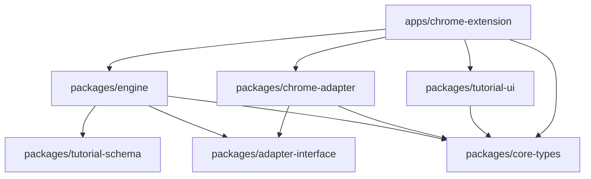
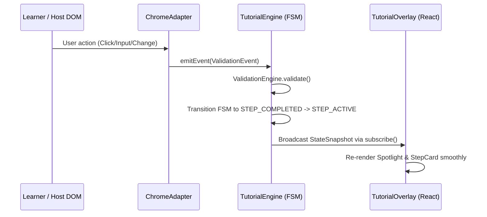

# Architecture Context — GuideMe

## 0. Repository Topology

GuideMe uses a **multi-repo** structure with a shared client-server API:

```text
Repo 1: GuideMe-Site (Web & API, full-stack repository / mini-monorepo)
├── frontend/                         # Web client
└── backend/                          # Shared API
                                      ▲
                                      │ API requests
Repo 2: GuideMe (Clients)
├── apps/chrome-extension/            # Browser extension client
└── desktop/                          # Future desktop client
```

The web frontend and backend are kept together as a **full-stack repository** (also
called a mini-monorepo). The browser extension and future desktop app are separate
clients that consume the backend API, forming a **multi-client client-server
architecture**. The extension's local tutorial engine remains usable offline; API
access is reserved for shared services such as authentication, authoring, sync, AI,
and audio/TTS integrations.

## 1. Stack

| Layer                      | Technology                                | Role                                                                              |
| :------------------------- | :---------------------------------------- | :-------------------------------------------------------------------------------- |
| **Client Workspace Build** | PNPM Workspaces + Vite / WXT              | Dependency orchestration and fast HMR bundling within the client repository.      |
| **Browser Extension**      | WXT (Web Extension Framework)             | Manifest V3 build system for Chrome & Firefox.                                    |
| **UI Presentation**        | React 18 + Tailwind CSS v4                | Declarative components (`packages/tutorial-ui`, popup, sidepanel).                |
| **Styling Isolation**      | Shadow DOM (`createShadowRootUi`)         | Complete encapsulation of CSS and DOM overlays.                                   |
| **Headless Engine**        | Pure JavaScript (ES Modules)              | Finite state machine, step resolution, action dispatcher (`packages/engine`).     |
| **Validation Engine**      | Native DOM Events & Predicates            | Interactive user action interceptor (`click`, `input`, `change`, `submit`, etc.). |
| **DOM Adapter**            | `@guideme/chrome-adapter`                 | Platform-specific DOM queries, MutationObserver element polling, URL listeners.   |
| **Schema Validation**      | `@guideme/tutorial-schema`                | Structural validation and normalization of declarative tutorial JSONs.            |
| **Audio & I18n**           | Web Audio API / HTML5 Audio + I18nManager | Dual-language (`km` / `en`) resolution and pluggable TTS provider integration.    |
| **Testing**                | Node.js Test Runner (`node:test`)         | Fast, native unit test execution for engine and dynamic analyzer.                 |

---

## 2. System Boundaries & The 7-Layer Architecture

```text
 ┌────────────────────────────────────────────────────────────────────────┐
 │ LAYER 7: AUTHORING SYSTEM (Visual Builder, JSON / DSL Editor, Studio)  │
 └───────────────────────────────────┬────────────────────────────────────┘
                                     │ Generates
                                     ▼
 ┌────────────────────────────────────────────────────────────────────────┐
 │ LAYER 6: TUTORIAL DEFINITION (JSON Schema, Domain Specific Language)   │
 └───────────────────────────────────┬────────────────────────────────────┘
                                     │ Ingests
                                     ▼
 ╔════════════════════════════════════════════════════════════════════════╗
 ║ LAYER 5: ENGINE CORE (Universal Headless Execution Engine)            ║
 ║  • Schema Validator    • Tutorial Parser   • State Machine (FSM)       ║
 ║  • Step Resolver       • Action Engine     • Validation Engine         ║
 ╚═══════════════════════════════════╤════════════════════════════════════╝
                                     │ Coordinates
                                     ▼
 ╔════════════════════════════════════════════════════════════════════════╗
 ║ LAYER 4: RUNTIME SERVICES (In-Memory Engine Context)                  ║
 ║  • Event System        • Variable Store    • Progress Manager          ║
 ║  • I18nManager (km/en) • AudioEngine       • DynamicPageAnalyzer       ║
 ╚═══════════════════════════════════╤════════════════════════════════════╝
                                     │ Dispatches
                                     ▼
 ┌────────────────────────────────────────────────────────────────────────┐
 │ LAYER 3: ADAPTER INTERFACE (`BaseTutorialAdapter` Protocol Contract)   │
 └───────────────────────────────────┬────────────────────────────────────┘
                                     │ Bridges
                                     ▼
 ┌────────────────────────────────────────────────────────────────────────┐
 │ LAYER 2: ENVIRONMENT INTEGRATION (Multi-Target Adapters & Overlays)    │
 │  • Chrome Adapter (MV3 Extension / Content Script / DOM Observer)      │
 │  • React Overlay UI (Isolated Shadow DOM `guideme-tutorial-root`)      │
 │  • SVG Spotlight Cutout & Smart Floating Tooltip                       │
 └───────────────────────────────────┬────────────────────────────────────┘
                                     │ Observes & Interacts
                                     ▼
 ┌────────────────────────────────────────────────────────────────────────┐
 │ LAYER 1: TARGET ENVIRONMENTS (Host Application & System Layers)        │
 │  • Host Web Page DOM (Google Docs, Google Sheets, SaaS Portals, etc.)  │
 └────────────────────────────────────────────────────────────────────────┘
```

---

## 3. Dependency Direction



- **Strict Decoupling Guardrail:** Zero engine or step execution logic inside React components.
- `@guideme/engine` has **zero dependencies** on React, Tailwind, or Chrome APIs. It communicates with the host environment exclusively through `BaseTutorialAdapter`.
- `@guideme/tutorial-ui` is a pure reactive view layer that receives immutable state snapshots from the engine and triggers callbacks.

---

## 4. Storage Model

1. **Durable Session Storage (`chrome.storage.local`):**
   - Key: `guideme_progress_${tutorialId}_${domain}`
   - Stores: `currentStepIndex`, `completedStepIds`, `completedAt`, `activeLanguage`.
   - Persists across tab reloads and browser restarts for curated walkthroughs.
2. **Ephemeral In-Memory State:**
   - Active execution variables, transient DOM coordinates, dynamic auto-guide step buffers, and audio playback status.

---

## 5. Auth and Access Model

- **Extension Permissions (MV3):**
  - Host Permissions: `<all_urls>` (allows on-demand dynamic auto-guiding across any site).
  - Runtime Permissions: `storage`, `activeTab`, `scripting`.
- **Zero Server Dependency for Core Guiding:**
  - The engine and parser operate 100% client-side without requiring mandatory user authentication.
  - Future Authoring Studio & Cloud Sync integrations will connect via OAuth 2.0 / JWT bearer tokens.

---

## 6. Architecture Invariants

1. **Zero Style Bleed:** All tutorial overlays, SVG masks, and floating tooltips must be rendered strictly inside an isolated Shadow DOM (`guideme-tutorial-root`). No CSS classes or styles may be injected directly into the host DOM.
2. **Headless Engine Autonomy:** The core engine (`@guideme/engine`) must remain 100% headless, testable in Node.js, and free of React or DOM globals.
3. **Khmer-First Dual-Language:** Khmer (`km`) is the primary default language for all UI copy, schema localization, and audio prompts; English (`en`) is the secondary supported language.
4. **State Immutability:** Engine state emitted to subscribers must be a cloned snapshot (`getStateSnapshot()`). UI components must never mutate engine internals directly.
5. **Non-Blocking Multi-Strategy Resolution:** Target element resolution must attempt multiple selectors (`css`, `text`, `ariaLabel`, `data-testid`) with non-blocking retry polling before timing out.
6. **Interaction Preservation:** SVG spotlight masks must not prevent the learner from clicking or typing into the highlighted host DOM element.

---

## 7. Frontend State Management



- **Observable Engine:** `TutorialEngine` exposes a `subscribe(callback)` pattern.
- **Cross-Boundary Messaging:** Content scripts, popup, and background service workers communicate via standard Chrome runtime messages (`ExtensionMessageAction`).

---

## 8. Core Data Entities

- **`TutorialDefinition`:** Root schema holding `id`, `name`, `version`, `matchUrls`, `defaultLanguage`, `steps[]`.
- **`StepDefinition`:** Single guidance step holding `id`, localized `title`, localized `instruction`, `target`, `action`, `validation`, `audio`.
- **`TargetSelector`:** Multi-strategy target matcher `{ css, text, ariaLabel, testId, timeout }`.
- **`ValidationRule`:** User interaction rule `{ type: 'click' | 'input' | 'change' | 'submit' | 'url_change' | 'manual_next', expectedValue }`.
- **`AudioPromptConfig`:** Localized voice prompt configuration `{ km: { audioUrl, ttsText }, en: { audioUrl, ttsText }, autoPlay, speechRate }`.
- **`EngineStateSnapshot`:** Reactive state emitted to UI `{ status, tutorialId, currentStepIndex, currentStep, totalSteps, language, targetRect, progress }`.

---

## 9. Error Handling Strategy

1. **Element Not Found / Detached:** If a target DOM node is not found within `timeoutMs`, the engine gracefully centers the tooltip card in the viewport and provides a "Skip Step" or "Retry" option without crashing.
2. **Dynamic SPA Route Changes:** The `URLListener` detects client-side pushState/replaceState changes; the engine re-evaluates the active step's preconditions and URL match.
3. **Invalid Tutorial Schema:** `TutorialParser` validates JSON against Zod/schema rules before execution, returning descriptive diagnostic errors rather than throwing runtime exceptions.
4. **Audio Playback Failure:** If an audio stream fails or TTS endpoint is unreachable, `AudioEngine` transitions to `AudioPlaybackStatus.ERROR` silently while retaining visual step guidance.

---

## 10. Risk Register

| #   | Risk                                                                | Severity  | Mitigation                                                                                                    |
| --- | ------------------------------------------------------------------- | --------- | ------------------------------------------------------------------------------------------------------------- |
| 1   | **Host CSS / Z-Index Clashes**                                      | 🟢 Low    | Isolated Shadow DOM (`createShadowRootUi`) with ultra-high `z-index: 2147483647` on host boundary.            |
| 2   | **Dynamic SPA Element Hydration Delays**                            | 🟡 Medium | `DOMObserver` with MutationObserver retry polling (up to 5000ms) and ResizeObserver for viewport adjustments. |
| 3   | **Complex Canvas / Shadow DOM Host Apps (e.g. Google Docs Canvas)** | 🟡 Medium | Multi-strategy target resolution combining aria-labels, toolbar IDs, and fallback manual navigation.          |
| 4   | **Extension Context Invalidation on Auto-Update**                   | 🟢 Low    | Defensive `try/catch` wrapping around `chrome.runtime.sendMessage` and background worker keep-alives.         |
| 5   | **Bilingual Font Rendering Glitches**                               | 🟢 Low    | Explicit font embedding of `@font-face` Kantumruy Pro and Inter directly inside Shadow DOM stylesheet.        |
