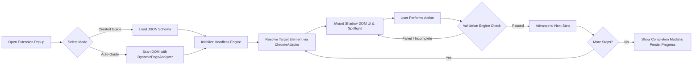

# GuideMe: Project Overview

## 1. Overview

**GuideMe** is a universal, interactive in-browser tutorial engine and browser extension (Manifest V3) built with **WXT**, **React 18**, and a **Headless JavaScript Engine**. It overlays non-intrusive step-by-step guidance, SVG spotlight cutouts, smart floating tooltips, and real-time interaction checkpoints directly on any web application (including complex SaaS portals like Google Docs, Google Sheets, Notion, etc).

GuideMe operates on a **Hybrid Guidance Model**:
1. **Precision Curated Walkthroughs:** High-fidelity, declarative JSON tutorial schemas targeting structured workflows with deterministic step preconditions and multi-strategy DOM resolution.
2. **Dynamic Auto-Guider (`DynamicPageAnalyzer`):** Zero-config real-time DOM analysis that inspects unknown web pages, classifies page archetypes (e-commerce, login forms, search pages, settings dashboards), and synthesizes interactive walkthroughs on the fly.
3. **Khmer-First Accessibility:** Native dual-language (`km` Khmer default / `en` English secondary) support with live language toggling, Kantumruy Pro typography, and an extensible `AudioEngine` for native voice prompts and TTS integration.

---

## 2. Goals

1. **Interactive In-Context Learning:** Enable users to learn complex web applications by doing—interacting directly with actual host DOM elements rather than watching passive videos or reading external documentation.
2. **Total UI & Style Isolation:** Render all tutorial overlays inside an isolated Shadow DOM (`guideme-tutorial-root`), guaranteeing 0% CSS collision with host applications.
3. **Decoupled Architecture:** Strict separation between the headless state machine (`@guideme/engine`), platform adapters (`@guideme/chrome-adapter`), UI presentation (`@guideme/tutorial-ui`), and schema definitions (`@guideme/tutorial-schema`).
4. **Dual-Language & Voice Accessibility:** Full Khmer (`km`) and English (`en`) support with instant runtime language switching and voice prompt audio playback.
5. **Universal Web Compatibility:** Seamlessly guide workflows across any URL via Chrome Manifest V3 extension with `<all_urls>` capabilities and dynamic MutationObserver element polling.

---

## 3. Core User Flow

1. **Discovery & Trigger:** The user opens the extension popup on any webpage. Matched curated tutorials are badged (`MATCHED`), or the user launches "Auto-Guide This Page" / inputs a custom intent prompt.
2. **Target Resolution:** The engine's `StepResolver` and `ChromeAdapter` query the DOM using multi-strategy fallbacks (`css`, `text`, `ariaLabel`, `data-testid`) with `MutationObserver` retry polling.
3. **Spotlight & Tooltip Rendering:** An isolated Shadow DOM mounts an SVG cutout overlay highlighting the target element with a floating auto-flip `StepCard` tooltip and optional Khmer/English voice prompt.
4. **Interactive Action & Validation:** The learner executes the required action (clicking a button, entering text, changing a dropdown, navigating). The `ValidationEngine` intercepts and verifies the event.
5. **Progression & Persistence:** The finite state machine transitions to the next step, updating session progress in `chrome.storage.local`.

---

## 4. Features

### 4.1 Curated Schema Walkthroughs
- Declarative JSON schemas with step titles, instructions, target selector strategies, action types (`spotlight`, `tooltip`, `modal`, `banner`), and validation triggers (`click`, `input`, `change`, `submit`, `url_change`, `manual_next`).
- Multi-step branching, precondition checks, and automatic URL matching.

### 4.2 Dynamic Page Auto-Guider (`DynamicPageAnalyzer`)
- Intelligent DOM scanner that extracts form inputs, primary CTA buttons, navigation bars, search fields, and headers.
- Classifies page archetypes: Login Form, E-Commerce, Search Page, Settings / Dashboard, and General Web App.
- Generates fully compliant runtime tutorial definitions from keyword prompts or raw page scans in under 5ms.

### 4.3 Isolated Shadow DOM Overlay (`@guideme/tutorial-ui`)
- Attached via WXT `createShadowRootUi` into `guideme-tutorial-root`.
- Non-blocking SVG spotlight mask with smooth corner cutouts and glowing pulse rings.
- Floating `StepCard` with smart auto-flip viewport positioning, progress bar, skip/prev/next controls, and Khmer/English audio equalizer.

### 4.4 Dual-Language & Audio Engine (`@guideme/engine`)
- **Languages:** Khmer (`km` - default) and English (`en` - secondary).
- Live language toggle without resetting active tutorial state or unmounting DOM overlays.
- `AudioEngine` managing audio prompts, playback states (`idle`, `buffering`, `playing`, `paused`, `ended`), and pluggable TTS provider interfaces (`BaseTtsProvider`).

### 4.5 Resilient DOM Adapter (`@guideme/chrome-adapter`)
- `DOMObserver` with `MutationObserver` and `ResizeObserver` for dynamic SPAs.
- Element polling with configurable timeout (default 5000ms).
- Persistent progress sync using `chrome.storage.local`.

---

## 5. Scope

### In Scope
- **Chrome Extension (Manifest V3):** Built with WXT, React 18, and pure JavaScript.
- **Headless Engine Monorepo:** 6 modular packages (`engine`, `tutorial-ui`, `chrome-adapter`, `adapter-interface`, `tutorial-schema`, `core-types`).
- **Hybrid Walkthrough System:** Both curated JSON guides and dynamic on-the-fly auto-guides.
- **Bilingual Support:** Full Khmer and English localization across UI, schema, and audio engine.
- **Offline Testbed Sandbox:** Built-in offline HTML testbed (`test-demo.html`) for deterministic testing.
- **Comprehensive Unit Test Suite:** Node.js native test runner covering engine, parser, i18n, audio, and dynamic analyzer.

### Out of Scope (Current Phase)
- **Visual Web Authoring Studio (Layer 7):** Visual drag-and-drop recording studio (reserved in monorepo for future release).
- **Firefox / Safari WebStore Distribution:** Extension is optimized for Chromium MV3; Firefox builds supported via WXT but store distribution is deferred.
- **On-Device Offline Neural TTS Models:** Current audio engine provides an online TTS adapter interface and audio clip playback; embedded offline neural voice models will be introduced in subsequent phases.

---

## 6. Success Criteria

1. **Zero CSS Collisions:** Overlay styles must never leak into or be affected by the host website DOM.
2. **Strict Headless Decoupling:** Engine and validation logic must have zero dependencies on React or DOM-specific frameworks.
3. **Sub-10ms Step Progression:** Step transitions and dynamic page scans must execute smoothly without UI lag or frame drops.
4. **Seamless Bilingual Switching:** Language toggling between Khmer and English must update all UI copy and audio references instantly without losing user progress.
5. **100% Automated Test Pass Rate:** All unit tests in `tests/` must pass deterministically across engine and dynamic analyzer suites.
