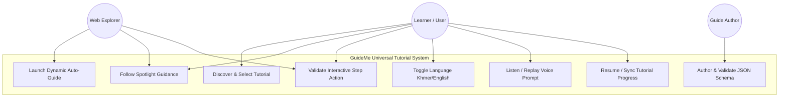
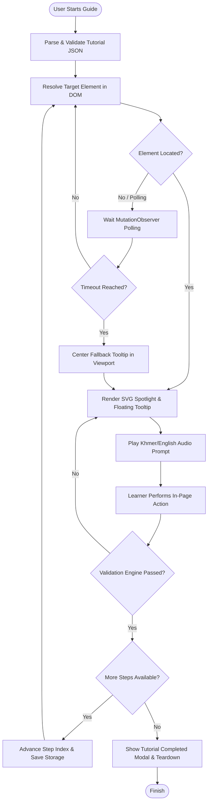
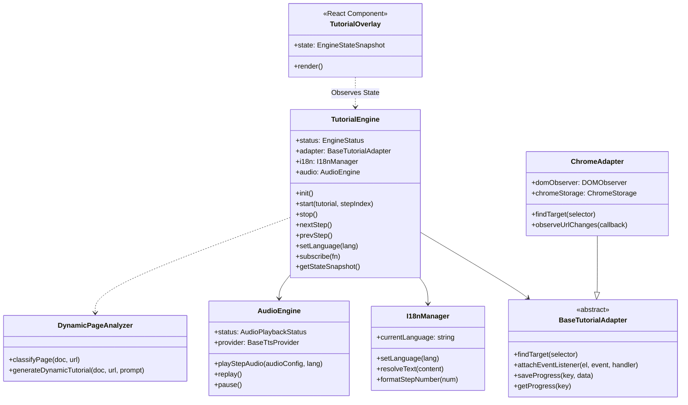
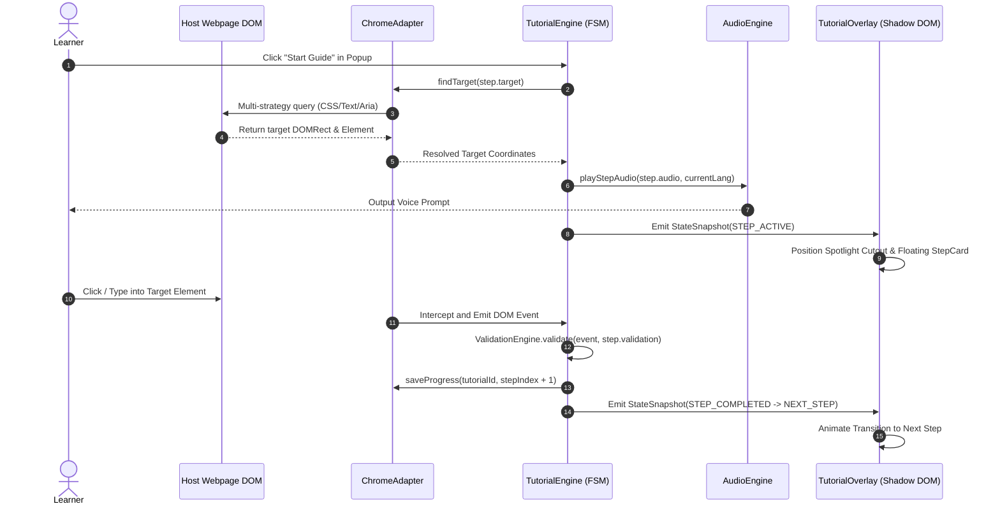

# Software Engineering (SE) Context — GuideMe

This document captures the software engineering deliverables, formal requirements, user stories, and UML diagrams for **GuideMe**.

---

## 1. Methodology

**Chosen Methodology:** Agile / Scrum (Lightweight, rapid iteration cycles).

**Cadence:**
- Sprint cycle: 1 to 2 weeks.
- Standup & Sync: Daily task alignment and CI validation.

**Definition of Done (DoD):**
1. Feature implemented within defined system layer boundaries.
2. No invariant in `context/architecture.md` is violated.
3. Complete happy-path, edge-case, and error-recovery logic implemented.
4. Unit tests written and passing in Node.js test runner (`npm test`).
5. Dual-language (`km` / `en`) localization maintained.
6. Zero styling bleed into host application DOM verified via Shadow DOM.

---

## 2. Scope (MVP & Current State)

### MVP Deliverables
- [x] **Headless Execution Engine (`@guideme/engine`):** Finite state machine, step resolver, validation engine, parser.
- [x] **Chrome Adapter (`@guideme/chrome-adapter`):** DOM observer with MutationObserver polling, storage sync, URL listeners.
- [x] **Isolated UI Overlay (`@guideme/tutorial-ui`):** SVG spotlight cutout, auto-flipping tooltip card, progress bar, audio equalizer.
- [x] **Dynamic Auto-Guider (`DynamicPageAnalyzer`):** On-the-fly DOM classification and step synthesis.
- [x] **Khmer-First Dual Language (`I18nManager`):** Instant `km` / `en` switching and localized schema parsing.
- [x] **Audio Engine Interface (`AudioEngine`):** Pluggable TTS provider adapter and audio playback controls.
- [x] **Browser Extension (`apps/chrome-extension`):** WXT Manifest V3 popup, background service worker, content script.

### Deferred / Future Phases
- Visual Drag-and-Drop Authoring Studio (Layer 7 Web App).
- Cloud Tutorial Sync & Analytics Backend.
- Embedded Offline Neural TTS engine.

---

## 3. Actors and Roles

| Actor | Role | Description |
| :--- | :--- | :--- |
| **Learner (End User)** | Consumer | Navigates web applications, follows interactive overlay steps, switches languages, listens to voice prompts. |
| **Creator / Author** | Content Producer | Authors declarative JSON walkthrough schemas or records guided workflows. |
| **Explorer** | Casual User | Browses unconfigured websites and launches "⚡ Auto-Guide This Page" to discover interfaces on the fly. |
| **System Administrator** | Manager | Deploys extension policies and monitors team onboarding completion metrics. |

---

## 4. Functional Requirements

- **FR-01 (Tutorial Ingestion & Parsing):** The engine shall parse declarative JSON schemas, validating step structures, target selectors, and validation types before execution.
- **FR-02 (Multi-Strategy Target Resolution):** The adapter shall resolve target DOM nodes using CSS selectors, text content, `aria-label`, and `data-testid`, with automatic `MutationObserver` polling.
- **FR-03 (Interactive SVG Spotlight):** The UI overlay shall render an SVG mask cutout highlighting target bounding rects without blocking user interactions with the target element.
- **FR-04 (Multi-Type Step Validation):** The engine shall validate step completion across click, input value matching, dropdown changes, form submissions, and URL changes.
- **FR-05 (Dynamic Zero-Config Auto-Guiding):** The system shall scan unknown web pages, classify page archetypes (login, e-commerce, search, settings), and generate interactive walkthroughs dynamically.
- **FR-06 (Bilingual Localization):** The system shall support Khmer (`km`) as default and English (`en`) as secondary, updating UI text and audio prompts instantly upon language toggle.
- **FR-07 (Audio Prompt Playback):** The audio engine shall play localized step voice prompts with replay, pause, and custom TTS provider integration.
- **FR-08 (Progress Persistence):** The system shall persist step progress and completion status in `chrome.storage.local`.

---

## 5. Non-Functional Requirements

- **NFR-01 (Security & Isolation):** The UI overlay must execute inside an isolated Shadow DOM (`guideme-tutorial-root`). No sensitive host page data or keystrokes outside defined target inputs shall be exfiltrated.
- **NFR-02 (Reliability & SPA Resilience):** Element polling must handle dynamic DOM hydration, client-side route changes, and asynchronous popups gracefully with configurable timeouts.
- **NFR-03 (Usability & Accessibility):** Typography must support legible Khmer Unicode (`Kantumruy Pro`) and English (`Inter`) with WCAG AA color contrast ratios and voice audio narration.
- **NFR-04 (Performance):** Dynamic page analysis must complete in under 10ms. Step transitions must maintain 60 FPS without memory leaks.
- **NFR-05 (Maintainability):** The headless engine must remain completely decoupled from React and Chrome APIs, allowing 100% headless testing in Node.js.

---

## 6. User Stories & Acceptance Criteria

### US-01: Run Google Docs Curated Walkthrough
- **As a** learner using Google Docs,  
  **I want** interactive spotlight guidance on sharing documents,  
  **So that** I can configure file permissions accurately without guessing.
- **Acceptance Criteria:**
  - Given I am on a Google Doc, when I click "Start Guide", the Share button is highlighted with an SVG spotlight.
  - When I click the Share button, the engine detects the click and transitions to the next step highlighting the permissions input.
  - When I close the guide, the overlay cleanly unmounts.

### US-02: Instant Auto-Guide on Unfamiliar Website
- **As an** explorer visiting an unfamiliar SaaS portal,  
  **I want** to click "⚡ Auto-Guide This Page",  
  **So that** I get an instant step-by-step tour of the page's core features.
- **Acceptance Criteria:**
  - Given any unscripted webpage, when I trigger Auto-Guide, the `DynamicPageAnalyzer` classifies the page and synthesizes an interactive 3-5 step tour.
  - The spotlight highlights the primary navigation and action elements in logical order.

### US-03: Live Bilingual Switching (Khmer / English)
- **As a** bilingual user in Cambodia,  
  **I want** to toggle between Khmer and English with one click,  
  **So that** I can understand instructions in my native language.
- **Acceptance Criteria:**
  - Given an active tutorial step, when I click `🇬🇧 EN` or `🇰🇭 ខ្មែរ`, the title, instruction body, button labels, and numerals update instantly without restarting the step.

---

## 7. Team Responsibilities

- **Core Engine & State Machine:** Headless state transitions, step validation engine, schema parser, unit test suite.
- **Chrome Extension & Adapter:** WXT MV3 configuration, background service worker, Chrome runtime messaging, DOM observer.
- **UI & Shadow DOM Components:** Tailwind CSS v4 styling, SVG spotlight math, auto-flip tooltip collision, React overlay components.
- **Accessibility & Dynamic Intelligence:** `DynamicPageAnalyzer` classification heuristics, `I18nManager`, `AudioEngine` TTS adapters.

---

## 8. UML Diagrams

### 8.1 Use Case Diagram

### 8.2 Activity Diagram: Curated Walkthrough Execution

### 8.3 Class & Component Architecture Diagram

### 8.4 Sequence Diagram: Step Execution & Event Interception

---

## 9. Assumptions and Open Questions

- **Assumption 1:** Host web pages allow DOM reading and event listening via standard Chrome MV3 Content Script permissions.
- **Assumption 2:** Modern browsers support Web Audio API / HTML5 Audio inside extensions.
- **Open Question 1:** Should cloud analytics tracking for completion rates be opt-in by default for privacy compliance?
- **Open Question 2:** When should the Layer 7 Visual Authoring Studio web application be scheduled for full implementation?
