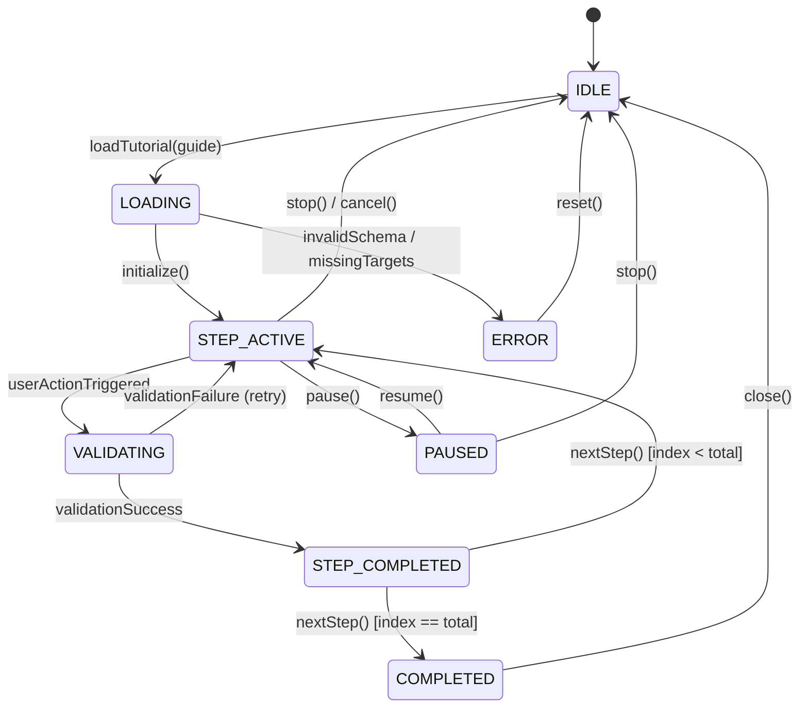
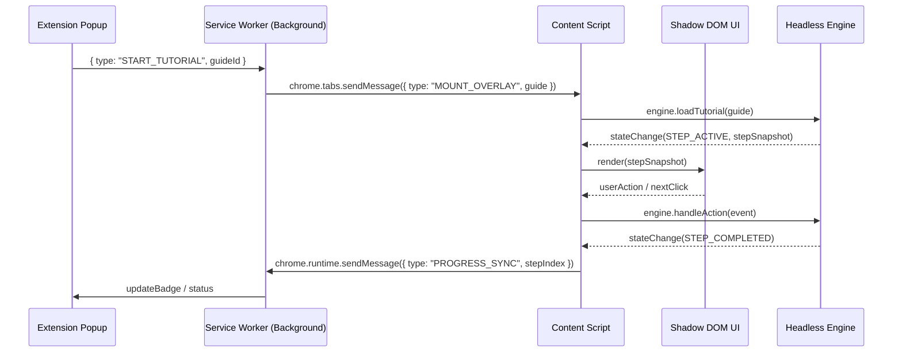

# GuideMe Architecture Specification

> **Single Source of Truth** for system design, boundaries, lifecycle, and component interactions.

---

## 1. System Vision & Paradigm

GuideMe is an open-source, offline-first, dual-language (**Khmer `km` / English `en`**) in-browser interactive tutorial engine implemented as a Chrome Extension (Manifest V3).

It operates on a **dual-mode engine architecture**:
1. **Pre-built Guide Mode**: Step-by-step guidance using pre-made JSON tutorial files for known web apps.
2. **⚡ Dynamic Auto-Guide Mode**: Real-time heuristic and AI-assisted DOM scanning that generates contextual step-by-step guidance on arbitrary, unscripted web pages from user prompts.

---

## 2. Monorepo Structure & Decoupling Boundaries

```
GuideMe/
├── packages/
│   ├── core-types/         # Shared TypeScript interfaces, zero runtime dependencies
│   ├── tutorial-schema/    # Zod validation schemas & parsers for JSON walkthroughs
│   ├── engine/             # 100% HEADLESS pure JS state machine & validation logic
│   │                       # NO React, NO Tailwind, NO Chrome APIs, NO DOM globals
│   ├── adapter-interface/  # Abstract contracts (IAdapter, IDOMObserver, IStorage)
│   ├── chrome-adapter/     # Chrome MV3 concrete adapter (MutationObserver, storage)
│   └── tutorial-ui/        # Isolated presentational React components (Spotlight, Tooltip)
├── apps/
│   ├── chrome-extension/   # WXT + Manifest V3 extension host
│   │   ├── entrypoints/
│   │   │   ├── background/ # Service worker: lifecycle, tab management, shortcuts
│   │   │   ├── content/    # Injected content script: mounts isolated Shadow DOM
│   │   │   └── popup/      # Toolbar popup: guide selector, settings, status
│   └── authoring-studio/   # Visual tutorial creator web app (Roadmap / Layer 7)
├── docs/                   # Consolidated core documentation & ADRs
│   ├── ARCHITECTURE.md     # This document
│   ├── STANDARDS.md        # Code standards, design system (60-30-10), QA protocols
│   ├── DECISIONS.md        # Architectural Decision Records (ADR 001–012)
│   ├── REQUIREMENTS.md     # Product specifications, schemas, DOM resolution
│   ├── PROGRESS.md         # Milestone and implementation status
│   ├── assets/             # UI prototypes and diagrams
│   └── _archive/           # Historical raw specs preserved for reference
└── tests/                  # Automated test suite (Vitest)
```

### Inviolable Monorepo Boundaries
- **Engine Autonomy**: `@guideme/engine` must run 100% headlessly in Node.js. It never imports React, Chrome APIs, or window/document globals.
- **Shadow DOM Isolation**: All UI overlays mount strictly within `#guideme-tutorial-root` via WXT `createShadowRootUi`. Host page styles never pollute GuideMe, and GuideMe CSS never leaks to the host.
- **Pure Presentational UI**: `@guideme/tutorial-ui` receives state snapshots and dispatches callbacks (`onNext`, `onPrev`, `onSkip`, `onClose`, `onLanguageChange`, `onThemeChange`). It never queries the host DOM directly.
- **Adapter Inversion**: Chrome-specific logic (storage, tabs, messaging) is injected via `adapter-interface` implementations.

---

## 3. 7-Layer Architectural Stack

GuideMe is organized in seven clean architectural layers:

```
┌────────────────────────────────────────────────────────┐
│  Layer 7: Authoring & Ingestion Layer                  │
│  (JSON Schemas, Studio App, Dynamic Synthesizer)       │
├────────────────────────────────────────────────────────┤
│  Layer 6: Extension Orchestration Layer                │
│  (Manifest V3, Service Worker, Content Scripts, WXT)   │
├────────────────────────────────────────────────────────┤
│  Layer 5: Presentation & Overlay Layer                 │
│  (Isolated Shadow DOM, SVG Spotlight, StepCard Tooltip)│
├────────────────────────────────────────────────────────┤
│  Layer 4: Browser Abstraction / Adapter Layer          │
│  (Chrome Storage, MutationObserver, Tab Messaging)    │
├────────────────────────────────────────────────────────┤
│  Layer 3: DOM Target Resolution & Validation Engine    │
│  (Multi-strategy Selector Resolution, Event Intercept) │
├────────────────────────────────────────────────────────┤
│  Layer 2: Core State Machine (Tutorial Engine)         │
│  (Deterministic FSM, History Stack, Immutable State)   │
├────────────────────────────────────────────────────────┤
│  Layer 1: Shared Primitives & Type Contracts           │
│  (TypeScript Interfaces, Zod Schemas, Error Enums)     │
└────────────────────────────────────────────────────────┘
```

---

## 4. Finite State Machine (FSM) Lifecycle

`TutorialEngine` implements a deterministic state machine:



### State Definitions
| State | Description | Allowed Actions |
| :--- | :--- | :--- |
| `IDLE` | Engine dormant; no active guide | `loadTutorial(guide)` |
| `LOADING` | Parsing JSON, validating schema, resolving step 0 element | Internal transition |
| `STEP_ACTIVE` | Target highlighted, tooltip rendered, event listeners attached | `pause()`, `stop()`, `skipStep()`, `prevStep()` |
| `VALIDATING` | Action detected; checking criteria (value match, click confirmation) | Internal transition |
| `STEP_COMPLETED`| Step verified; brief success visual before advancing | `nextStep()` |
| `PAUSED` | Guidance temporarily suspended; spotlight hidden | `resume()`, `stop()` |
| `COMPLETED` | Final step finished; completion screen displayed | `reset()`, `close()` |
| `ERROR` | Target element missing, timeout exceeded, or schema corrupted | `retry()`, `skipStep()`, `reset()` |

---

## 5. Cross-Context Messaging Architecture

Communication between extension contexts uses structured typed messages:



### Message Types
- `START_TUTORIAL`: Popup/Background -> Content Script (initiate walkthrough)
- `STOP_TUTORIAL`: Popup/Content -> Engine (terminate and clean up)
- `STEP_CHANGED`: Engine -> Content/UI (sync active step state)
- `VALIDATE_ACTION`: Content Event Listener -> Validation Engine
- `AI_RERANK_REQUEST`: Content -> Backend API (`POST /api/v1/ai/intent-rerank`)
- `THEME_CHANGE`: Popup/Overlay -> All Views (sync `'light'` | `'dark'`)
- `LANGUAGE_CHANGE`: Popup/Overlay -> All Views (sync `'km'` | `'en'`)

---

## 6. AI-First Intent Pipeline & Fuse.js Grounded DOM Scanner (ADR-014)

For natural language chat, unscripted pages, and real-time guidance requests, GuideMe executes an AI-First Grounded Pipeline:

```
User Prompt ("heeloo brooo" or "help me share this document")
  │
  ▼
Cloud/Backend AI Assistant (POST /api/ai/assistant-chat)
  ├── Primary Engine: Google Gemini (gemini-3.6-flash, sub-second latency <500ms)
  ├── Secondary Fallback: NVIDIA AI NIM (moonshotai/kimi-k3 / Llama-3.3-70B)
  ├── No Premature Regex Gatekeeper: Handles colloquial greetings, typos, and slang directly
  ├── Natural conversational reply returned to active chat tab immediately
  └── If Actionable: Returns structured intent { targetQuery: "Share", action: "click", role: "button" }
  │
  ▼
Content Script: Fuse.js DOM Scanner & Modal Primacy (<5ms local execution)
  ├── DomObserver.getActiveModal(): Detects open <dialog>, [role="dialog"], [aria-modal="true"], and .apps-share-dialog
  ├── Modal Scoping: Excludes background elements behind backdrops (prevents toolbar collisions)
  ├── harvestInteractiveElements(): Collects real visible nodes across light DOM, Shadow Roots, and iframes
  ├── matchDomElementWithFuse(): Fuzzy-matches targetQuery against real node text, aria-labels, placeholders
  ├── Context & Spatial Weighting: Modal primacy (+40), viewport visibility (+25), action-role affinity (+30)
  └── deriveConcreteSelector(): Derives verified, non-hallucinated CSS selector directly from winning DOM node
  │
  ▼
Grounded Step Execution
  ├── Synthesizes valid declarative GuideMe step
  └── Locks Spotlight & Tooltip onto verified real physical element on screen
```

### Offline / Network-Error Fallback
If the backend AI service is unreachable or offline, the system seamlessly falls back to local `classifyPrompt`:
- Exact and fuzzy greetings (e.g. "heeloo brooo", "សួស្ដីបង") receive warm offline greetings.
- Actionable commands execute local Fuse.js candidate search against the current page DOM.

---

## 7. Error Handling & Graceful Recovery

1. **Missing Target (0x0 Coordinate)**: When an element cannot be found or has `display: none`:
   - Spotlight rendering is suppressed (prevents 0,0 top-left glitch).
   - Tooltip falls back to viewport center modal.
   - Shows retry banner with Khmer (`មិនអាចកំណត់ទីតាំងបានទេ`) and English text.
2. **DOM Detachment / SPA Navigation**:
   - `DOMObserver` handles dynamic element replacement via `MutationObserver` with configurable timeout (default 5000ms).
   - Event listeners auto-rebind if host framework tears down nodes.
3. **Storage Fallback**:
   - Primary: `chrome.storage.local`.
   - Fallback: in-memory map for headless tests and unsupported environments.
