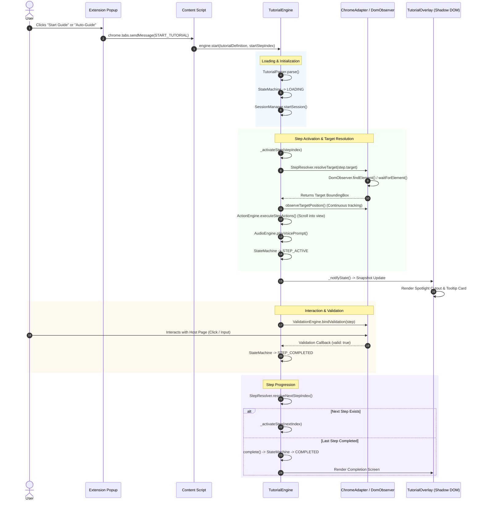

# GuideMe Extension Engine — Core Components & Lifecycle

This document provides a comprehensive technical breakdown of the architecture, core engine components, state machine, and end-to-end execution lifecycle of the **GuideMe Universal Tutorial Engine**.

---

## 1. Architectural Overview

GuideMe is architected as a **headless, decoupled monorepo**. The core engine is completely platform-agnostic, interacting with the browser DOM through an adapter layer and emitting reactive state updates to an isolated UI layer in the Shadow DOM.

```
┌────────────────────────────────────────────────────────────────────────┐
│                        apps/chrome-extension                           │
│  • Popup UI (React, catalog selection, auto-guide trigger)             │
│  • Background Service Worker (runtime listeners, tab communication)    │
│  • Content Script Entrypoint (mounts isolated Shadow DOM)              │
└───────────────────────────────────┬────────────────────────────────────┘
                                    │ Mounts & sends extension messages
                                    ▼
┌────────────────────────────────────────────────────────────────────────┐
│                         packages/tutorial-ui                           │
│  • TutorialOverlay (main container in Shadow DOM)                      │
│  • Spotlight (SVG cutout overlay, element highlighting)                │
│  • Tooltip & StepCard (instruction card, controls, badge)              │
│  • AudioEqualizer & FloatingPrompt (voice visualizer & AI input)       │
└───────────────────────────────────▲────────────────────────────────────┘
                                    │ Subscribes to state updates
                                    ▼
┌────────────────────────────────────────────────────────────────────────┐
│                          packages/engine                               │
│  ┌──────────────────────────────────────────────────────────────────┐  │
│  │ TutorialEngine (Main Coordinator & Public API)                   │  │
│  ├──────────────────────────────┬───────────────────────────────────┤  │
│  │ StateMachine                 │ StepResolver                      │  │
│  ├──────────────────────────────┼───────────────────────────────────┤  │
│  │ ValidationEngine             │ ActionEngine                      │  │
│  ├──────────────────────────────┼───────────────────────────────────┤  │
│  │ DynamicPageAnalyzer          │ TutorialParser                    │  │
│  ├──────────────────────────────┼───────────────────────────────────┤  │
│  │ I18nManager (KM / EN)        │ AudioEngine (TTS & Voice)         │  │
│  ├──────────────────────────────┼───────────────────────────────────┤  │
│  │ EventBus                     │ VariableStore & SessionManager    │  │
│  └──────────────────────────────┴───────────────────────────────────┘  │
└───────────────────────────────────▲────────────────────────────────────┘
                                    │ Queries DOM & binds events
                                    ▼
┌────────────────────────────────────────────────────────────────────────┐
│                      packages/chrome-adapter                           │
│  • ChromeAdapter (implements BaseTutorialAdapter)                      │
│  • DomObserver (multi-strategy query & MutationObserver polling)       │
│  • ChromeStorage & EventListener (persistence & window/tab listeners)  │
└────────────────────────────────────────────────────────────────────────┘
```

---

## 2. Core Components

### 2.1 [TutorialEngine](file:///home/saoly/Documents/Code/GuideMeApp/GuideMe/packages/engine/src/engine.js#L17)
The central orchestrator that coordinates all subsystems.
- **Responsibilities**:
  - Exposes the public API (`start()`, `nextStep()`, `prevStep()`, `skipStep()`, `pause()`, `resume()`, `stop()`, `complete()`, `setLanguage()`).
  - Manages subscriptions via [EventBus](file:///home/saoly/Documents/Code/GuideMeApp/GuideMe/packages/engine/src/runtime/event-bus.js).
  - Emits localized state snapshots via `getStateSnapshot()` whenever engine state, active step, language, or audio playback changes.

### 2.2 [StateMachine](file:///home/saoly/Documents/Code/GuideMeApp/GuideMe/packages/engine/src/state-machine/state-machine.js)
Maintains strict, deterministic engine status transitions.
- **Statuses**:
  - `IDLE`: Engine initialized, awaiting tutorial start.
  - `LOADING`: Parsing tutorial schema and preparing initial step.
  - `STEP_ACTIVE`: Step active, target element located, spotlight active.
  - `VALIDATING`: User interaction event captured and under condition evaluation.
  - `STEP_COMPLETED`: Validation succeeded, transitioning to the next step.
  - `PAUSED`: Tutorial paused by user.
  - `COMPLETED`: All steps completed successfully.
  - `ERROR`: Unrecoverable schema or DOM failure encountered.

### 2.3 [TutorialParser](file:///home/saoly/Documents/Code/GuideMeApp/GuideMe/packages/engine/src/parser/parser.js)
Validates and normalizes raw JSON tutorial definitions.
- **Responsibilities**:
  - Validates JSON structure, required fields, and step configurations.
  - Resolves bidirectional step indexing (`defaultNextStepIndex`, `defaultPrevStepIndex`).
  - Builds an in-memory `stepMap` (`Map<string, Step>`) for $O(1)$ ID lookups during non-linear branching.

### 2.4 [StepResolver](file:///home/saoly/Documents/Code/GuideMeApp/GuideMe/packages/engine/src/resolver/step-resolver.js#L4)
Resolves active step targets and evaluates conditional navigation branches.
- **Responsibilities**:
  - Requests DOM coordinates and bounding boxes from the platform adapter.
  - Evaluates explicit branching targets (`onSuccessNextStepId`) versus sequential next steps.

### 2.5 [DomObserver](file:///home/saoly/Documents/Code/GuideMeApp/GuideMe/packages/chrome-adapter/src/dom-observer.js#L4) & [ChromeAdapter](file:///home/saoly/Documents/Code/GuideMeApp/GuideMe/packages/chrome-adapter/src/chrome-adapter.js)
Bridges the engine to the live browser window and DOM.
- **Multi-Strategy Selector Cascade**:
  1. **Direct CSS Selector**: `selector.css` (e.g. `#share-button`)
  2. **Test Attributes**: `[data-testid="..."]` / `[data-cy="..."]`
  3. **Accessibility Labels**: `[aria-label="..."]`
  4. **Visible Text Content**: Case-insensitive text match on clickable candidates (`button`, `a`, `span`, `div`, `[role="button"]`)
  5. **XPath Query**: `selector.xpath`
- **Dynamic Polling**: Uses `MutationObserver` (with configurable timeout, default 5000ms) to detect asynchronous elements rendered via AJAX/client-side routing.
- **Position Tracking**: Continuously monitors target scroll/resize and broadcasts updated bounding rects.

### 2.6 [ValidationEngine](file:///home/saoly/Documents/Code/GuideMeApp/GuideMe/packages/engine/src/validation/validation-engine.js)
Binds non-intrusive DOM event listeners to validate user progression.
- **Supported Triggers**: `click`, `input`, `change`, `submit`, `custom`.
- **Validation Rules**:
  - Value matching (`expectedValue`).
  - Regex pattern matching (`pattern`).
  - Min/max character length.
  - Auto-advance on successful match.

### 2.7 [ActionEngine](file:///home/saoly/Documents/Code/GuideMeApp/GuideMe/packages/engine/src/actions/action-engine.js)
Executes pre-step and post-step side effects.
- **Capabilities**:
  - `scrollToElement`: Smoothly scrolls target into the viewport.
  - `focus`: Focuses input elements.
  - Formats action UI payloads for tooltips and banners.

### 2.8 [I18nManager](file:///home/saoly/Documents/Code/GuideMeApp/GuideMe/packages/engine/src/i18n/i18n-manager.js)
Provides first-class bilingual support (Khmer `km` & English `en`).
- **Features**:
  - Resolves localized string objects (`{ km: "...", en: "..." }`) with automatic fallbacks.
  - Emits `LANGUAGE_CHANGE` events to trigger live UI text updates and synchronized voice prompt re-narration.

### 2.9 [AudioEngine](file:///home/saoly/Documents/Code/GuideMeApp/GuideMe/packages/engine/src/audio/audio-engine.js), [GenericHttpTtsProvider](file:///home/saoly/Documents/Code/GuideMeApp/GuideMe/packages/engine/src/audio/generic-http-tts-provider.js) & [TtsRegistry](file:///home/saoly/Documents/Code/GuideMeApp/GuideMe/packages/engine/src/audio/tts-registry.js)
Handles step-by-step voice guidance, AI TTS synthesis, and narration.
- **Capabilities**:
  - Declarative, non-hardcoded [GenericHttpTtsProvider](file:///home/saoly/Documents/Code/GuideMeApp/GuideMe/packages/engine/src/audio/generic-http-tts-provider.js) that can connect to **any** AI API (OpenAI, ElevenLabs, Google Cloud, Azure, local Ollama/Bark, or custom Khmer AI endpoints) via template variables (`{{TEXT}}`, `{{LANG}}`, `{{API_KEY}}`, `{{RATE}}`, `{{VOICE}}`).
  - [TtsRegistry](file:///home/saoly/Documents/Code/GuideMeApp/GuideMe/packages/engine/src/audio/tts-registry.js) factory that automatically builds and registers plug-and-play drivers from environment variables (`WXT_TTS_*`) or runtime presets.
  - Automatically synthesizes speech, handles streaming audio blobs / Base64 JSON responses, and falls back gracefully to browser `SpeechSynthesis`.
  - Tracks playback states (`IDLE`, `PLAYING`, `PAUSED`, `ERROR`) to drive the visualizer equalizer in the UI overlay.

### 2.10 [DynamicPageAnalyzer](file:///home/saoly/Documents/Code/GuideMeApp/GuideMe/packages/engine/src/dynamic/dynamic-analyzer.js)
Heuristics-based DOM inspection engine for on-the-fly walkthrough creation.
- **Capabilities**:
  - Analyzes unscripted pages to classify page type (`loginForm`, `searchPage`, `ecommerceProduct`, `settingsPage`, `genericDashboard`).
  - Automatically synthesizes a validated bilingual tutorial schema on demand without pre-authored JSON.

### 2.11 [TutorialOverlay](file:///home/saoly/Documents/Code/GuideMeApp/GuideMe/packages/tutorial-ui/src/components/TutorialOverlay.jsx) (Shadow DOM)
The visual overlay mounted in [Content Script Entrypoint](file:///home/saoly/Documents/Code/GuideMeApp/GuideMe/apps/chrome-extension/entrypoints/content/index.jsx).
- **Features**:
  - Encapsulated inside `guideme-tutorial-root` Shadow DOM to prevent CSS bleeding.
  - Renders an SVG spotlight mask that darkens the background while keeping the target element interactive (`pointer-events: none` on the cutout).
  - Dynamically calculates tooltip positioning (top, bottom, left, right) relative to the target's bounding box.

---

## 3. Engine Execution Lifecycle



### Lifecycle Phases in Detail

#### Phase 1: Initiation
1. A tutorial request is triggered from the Extension Popup or through Dynamic Auto-Guide.
2. The content script receives the message and invokes `engine.start(tutorialDef)`.

#### Phase 2: Schema Parsing & Indexing
1. `TutorialParser.parse()` validates required fields (`id`, `steps`, `matchUrls`).
2. Generates sequential links (`defaultNextStepIndex`, `defaultPrevStepIndex`) and constructs the `stepMap`.
3. `StateMachine` transitions from `IDLE` to `LOADING`.

#### Phase 3: Step Activation
1. `_activateStep(stepIndex)` cleans up previous observers and event listeners.
2. `StepResolver` calls `ChromeAdapter.findTarget(step.target, timeoutMs)`.
3. `DomObserver` locates the element using the selector cascade, falling back to `MutationObserver` polling if the element is not yet in the DOM.
4. Continuous position tracking is attached to handle page scrolls or layout shifts.
5. Pre-step actions (such as scrolling the element into view) are executed.
6. `AudioEngine` synthesizes or plays audio narration for the active language.
7. `StateMachine` transitions to `STEP_ACTIVE`.

#### Phase 4: State Broadcast & UI Rendering
1. `TutorialEngine.getStateSnapshot()` compiles the active step, localized text, bounding rect, and audio status.
2. `TutorialOverlay` inside the Shadow DOM receives the snapshot and updates:
   - Spotlight SVG mask cuts out the bounding box over the target element.
   - Tooltip card is positioned relative to the target with appropriate offsets and collision detection.

#### Phase 5: Interaction Validation & Progression
1. `ValidationEngine` attaches DOM event listeners (`click`, `input`, `change`) to the target.
2. When the user performs the required action, the validator checks criteria:
   - If valid: emits `EngineEvent.STEP_SUCCESS`, records progress via `SessionManager`, and transitions to `STEP_COMPLETED`.
   - Advances to `nextStep()` or completes the tutorial if no further steps remain.

#### Phase 6: Teardown & Reset
1. When `stop()`, `complete()`, or `destroy()` is called:
   - All active `MutationObserver` and DOM event listeners are detached.
   - Audio playback is halted.
   - Session progress is persisted or reset.
   - `StateMachine` transitions to `COMPLETED` or resets to `IDLE`.

---

## 4. File Reference Map

| Component | File Path |
| :--- | :--- |
| **Tutorial Engine** | [packages/engine/src/engine.js](file:///home/saoly/Documents/Code/GuideMeApp/GuideMe/packages/engine/src/engine.js) |
| **State Machine** | [packages/engine/src/state-machine/state-machine.js](file:///home/saoly/Documents/Code/GuideMeApp/GuideMe/packages/engine/src/state-machine/state-machine.js) |
| **Step Resolver** | [packages/engine/src/resolver/step-resolver.js](file:///home/saoly/Documents/Code/GuideMeApp/GuideMe/packages/engine/src/resolver/step-resolver.js) |
| **Validation Engine** | [packages/engine/src/validation/validation-engine.js](file:///home/saoly/Documents/Code/GuideMeApp/GuideMe/packages/engine/src/validation/validation-engine.js) |
| **Action Engine** | [packages/engine/src/actions/action-engine.js](file:///home/saoly/Documents/Code/GuideMeApp/GuideMe/packages/engine/src/actions/action-engine.js) |
| **Dynamic Page Analyzer** | [packages/engine/src/dynamic/dynamic-analyzer.js](file:///home/saoly/Documents/Code/GuideMeApp/GuideMe/packages/engine/src/dynamic/dynamic-analyzer.js) |
| **Tutorial Parser** | [packages/engine/src/parser/parser.js](file:///home/saoly/Documents/Code/GuideMeApp/GuideMe/packages/engine/src/parser/parser.js) |
| **I18n Manager** | [packages/engine/src/i18n/i18n-manager.js](file:///home/saoly/Documents/Code/GuideMeApp/GuideMe/packages/engine/src/i18n/i18n-manager.js) |
| **Audio Engine** | [packages/engine/src/audio/audio-engine.js](file:///home/saoly/Documents/Code/GuideMeApp/GuideMe/packages/engine/src/audio/audio-engine.js) |
| **Generic HTTP TTS Provider** | [packages/engine/src/audio/generic-http-tts-provider.js](file:///home/saoly/Documents/Code/GuideMeApp/GuideMe/packages/engine/src/audio/generic-http-tts-provider.js) |
| **TTS Registry & Presets** | [packages/engine/src/audio/tts-registry.js](file:///home/saoly/Documents/Code/GuideMeApp/GuideMe/packages/engine/src/audio/tts-registry.js) |
| **AI TTS Provider** | [packages/engine/src/audio/ai-tts-provider.js](file:///home/saoly/Documents/Code/GuideMeApp/GuideMe/packages/engine/src/audio/ai-tts-provider.js) |
| **DOM Observer** | [packages/chrome-adapter/src/dom-observer.js](file:///home/saoly/Documents/Code/GuideMeApp/GuideMe/packages/chrome-adapter/src/dom-observer.js) |
| **Chrome Adapter** | [packages/chrome-adapter/src/chrome-adapter.js](file:///home/saoly/Documents/Code/GuideMeApp/GuideMe/packages/chrome-adapter/src/chrome-adapter.js) |
| **Content Script Entrypoint** | [apps/chrome-extension/entrypoints/content/index.jsx](file:///home/saoly/Documents/Code/GuideMeApp/GuideMe/apps/chrome-extension/entrypoints/content/index.jsx) |
| **Tutorial UI Overlay** | [packages/tutorial-ui/src/components/TutorialOverlay.jsx](file:///home/saoly/Documents/Code/GuideMeApp/GuideMe/packages/tutorial-ui/src/components/TutorialOverlay.jsx) |
