# Universal Tutorial Engine (GuideMe) — Master Use Case Diagram & Specification

> **Comprehensive UML Use Case Model illustrating system actors, hybrid guiding workflows, runtime interactions, and lifecycle management.**

---

## 1. Master UML Use Case Diagram

```mermaid
graph TD
    %% ================= ACTORS =================
    Learner["👤 Actor: Learner (End User)"]
    Author["✍️ Actor: Tutorial Author / Creator"]
    Admin["⚙️ Actor: Administrator / Team Manager"]
    Engine["⚡ System: GuideMe Headless Engine"]

    %% ================= USE CASE PACKAGES =================
    subgraph Discovery ["1. Discovery & Initiation"]
        UC1("UC1: Install & Mount Extension")
        UC2("UC2: Launch Curated Guide (e.g. Google Docs)")
        UC3("UC3: Trigger Dynamic Auto-Guide (Universal Mode)")
    end

    subgraph Overlay ["2. Runtime Overlay & Execution"]
        UC4("UC4: Render Shadow DOM Spotlight Cutout")
        UC5("UC5: Position Floating Tooltip with Auto-Flip")
        UC6("UC6: Perform Interaction & Validate Action")
        UC7("UC7: Track Dynamic Menus & Modal Mutations")
        UC8("UC8: Synchronize Real-time Viewport & Scroll")
    end

    subgraph Lifecycle ["3. Session & Lifecycle Management"]
        UC9("UC9: Save & Resume Progress (chrome.storage)")
        UC10("UC10: Dismiss / Pause / Clean Teardown")
        UC11("UC11: Complete Walkthrough & Submit Feedback")
    end

    subgraph Authoring ["4. Authoring & Administration"]
        UC12("UC12: Define & Validate JSON Step Schema")
        UC13("UC13: Manage Access Tiers & Feature Limits")
    end

    %% ================= ACTOR RELATIONSHIPS =================
    Learner -->|Installs & opens popup| UC1
    Learner -->|Selects verified guide| UC2
    Learner -->|Clicks 'Auto-Guide Page'| UC3
    Learner -->|Views focus spotlight| UC4
    Learner -->|Reads instructions| UC5
    Learner -->|Clicks, inputs, or submits| UC6
    Learner -->|Resizes window or scrolls| UC8
    Learner -->|Resumes previous session| UC9
    Learner -->|Clicks close ✕ or Stop| UC10
    Learner -->|Completes walkthrough & rates| UC11

    Author -->|Authors step flows & selectors| UC12
    Admin -->|Configures permissions & tiers| UC13

    %% ================= SYSTEM RELATIONSHIPS =================
    Engine -.->|Classifies DOM & synthesizes steps| UC3
    Engine -.->|Computes bounding box cutout| UC4
    Engine -.->|Calculates viewport collision bounds| UC5
    Engine -.->|Intercepts events & validates rules| UC6
    Engine -.->|MutationObserver on dynamic elements| UC7
    Engine -.->|ResizeObserver position tracking| UC8
    Engine -.->|Durable session serialization| UC9
    Engine -.->|Unmounts overlays & clears listeners| UC10
    Engine -.->|Emits completion event| UC11
    Engine -.->|Validates Zod/JSON schema structure| UC12

    %% ================= INCLUDES & EXTENDS =================
    UC2 -->|<<include>>| UC4
    UC3 -->|<<include>>| UC4
    UC4 -->|<<include>>| UC5
    UC6 -->|<<include>>| UC4
    UC6 -.->|<<extend>>| UC7
    UC8 -.->|<<extend>>| UC4
    UC6 -.->|<<extend>>| UC9
    UC6 -.->|<<extend>>| UC11

    %% ================= 60-30-10 STYLES =================
    style Learner fill:#181b22,stroke:#f59e0b,stroke-width:2px,color:#ffffff
    style Author fill:#181b22,stroke:#f59e0b,stroke-width:2px,color:#ffffff
    style Admin fill:#181b22,stroke:#f59e0b,stroke-width:2px,color:#ffffff
    style Engine fill:#12141a,stroke:#3b82f6,stroke-width:2px,color:#ffffff

    style UC1 fill:#181b22,stroke:#3e4556,color:#ffffff
    style UC2 fill:#181b22,stroke:#f59e0b,stroke-width:2px,color:#ffffff
    style UC3 fill:#181b22,stroke:#f59e0b,stroke-width:2px,color:#ffffff
    style UC4 fill:#181b22,stroke:#f59e0b,color:#ffffff
    style UC5 fill:#181b22,stroke:#3e4556,color:#ffffff
    style UC6 fill:#181b22,stroke:#10b981,stroke-width:2px,color:#ffffff
    style UC7 fill:#181b22,stroke:#3e4556,color:#ffffff
    style UC8 fill:#181b22,stroke:#3e4556,color:#ffffff
    style UC9 fill:#181b22,stroke:#3e4556,color:#ffffff
    style UC10 fill:#181b22,stroke:#ef4444,color:#ffffff
    style UC11 fill:#181b22,stroke:#10b981,color:#ffffff
    style UC12 fill:#181b22,stroke:#3e4556,color:#ffffff
    style UC13 fill:#181b22,stroke:#3e4556,color:#ffffff
```

---

## 2. Actors & Responsibilities

| Actor | Type | Description |
|---|---|---|
| **Learner (End User)** | Human Primary | Visits supported applications (e.g. Google Docs) or arbitrary websites. Interacts with on-screen spotlights, types text, clicks buttons, and follows step-by-step guidance. |
| **Tutorial Author / Creator** | Human Secondary | Designs and publishes declarative JSON tutorial workflows using multi-strategy selectors (`css`, `aria-label`, text matching) and validation criteria. |
| **Administrator / Team Manager** | Human Secondary | Manages access permissions, review completion analytics, and configures feature tiers (Free vs. Pro/Team). |
| **GuideMe Engine System** | Automated Subsystem | Executes the finite state machine, observes DOM mutations, calculates bounding boxes, enforces zero CSS bleeding via Shadow DOM, and intercepts interaction events. |

---

## 3. Detailed Use Case Catalog

### Package 1: Discovery & Initiation

#### UC1: Install & Mount Extension
- **Primary Actor:** Learner
- **Precondition:** User is running Chromium (Chrome, Edge, Brave) or Firefox.
- **Trigger:** Learner installs extension from Web Store or loads unpacked extension.
- **Flow:**
  1. Content script mounts isolated Shadow Root (`guideme-tutorial-root`) into the host page `body`.
  2. Background Service Worker initializes state storage and registers runtime message handlers.
- **Postcondition:** System is standby-ready without modifying host page DOM.

#### UC2: Launch Curated Guide
- **Primary Actor:** Learner
- **Precondition:** User is on a supported domain (e.g. `docs.google.com/document/*`).
- **Trigger:** User clicks extension icon $\rightarrow$ sees matched curated guide (e.g. *"Share & Manage Permissions"*) $\rightarrow$ clicks **"Start Guide"**.
- **Flow:**
  1. Popup sends `START_TUTORIAL` command with `tutorialId` to active tab.
  2. Engine parses verified schema, transitions to `LOADING`, and activates Step 1.
- **Postcondition:** SVG spotlight cutout highlights Step 1 target element.

#### UC3: Trigger Dynamic Auto-Guide (Universal Mode)
- **Primary Actor:** Learner
- **Precondition:** User is on an unscripted webpage (e.g. login form, e-commerce, settings portal).
- **Trigger:** User clicks **"⚡ Auto-Guide This Page"** from extension popup.
- **Flow:**
  1. Content script executes `DynamicPageAnalyzer.analyzePage(document, url)`.
  2. Pattern recognizer classifies page category (`loginForm`, `searchPage`, `ecommerceProduct`, `settingsPage`, `dashboard`, `generic`).
  3. Synthesizes an on-the-fly tutorial schema and feeds it to the headless state machine.
- **Postcondition:** Auto-generated step 1 spotlight mounts over the primary detected element.

---

### Package 2: Runtime Overlay & Interaction Execution

#### UC4: Render Shadow DOM Spotlight Cutout
- **Primary Actor:** System / Learner
- **Flow:**
  1. Engine resolves target element bounding box (`DOMRect`).
  2. UI Layer renders a dark SVG backdrop mask (`rgba(15, 17, 23, 0.82)`) with a rounded cutout hole matching the target element.
  3. Draws an animated Warm Yellow-Orange focus outline (`#F59E0B`) with subtle glow.
- **Postcondition:** Target element is brightly spotlighted; surrounding page is softly dimmed.

#### UC5: Position Floating Tooltip with Auto-Flip
- **Primary Actor:** Learner
- **Flow:**
  1. Floating tooltip computes coordinates relative to target (`top`, `bottom`, `left`, `right`).
  2. If card overflows the viewport boundary, auto-flips to the opposite orientation.
  3. Renders step title, description, step counter pill (`STEP X OF Y`), progress bar, and controls.
- **Postcondition:** Tooltip is always 100% visible inside the viewport.

#### UC6: Perform Interaction & Validate Action
- **Primary Actor:** Learner
- **Flow:**
  - **Click Validation:** Learner clicks the real highlighted DOM button $\rightarrow$ Adapter intercepts event $\rightarrow$ validates condition $\rightarrow$ advances to Step $N+1$.
  - **Input Validation:** Learner types in input box $\rightarrow$ submits via `Enter` or leaves field (`change`) $\rightarrow$ Engine validates entry $\rightarrow$ advances step without premature interruption.
  - **Manual Advance:** Learner clicks "Next" on tooltip $\rightarrow$ Engine advances.
- **Postcondition:** Step transitions smoothly to the next checkpoint or completion screen.

#### UC7: Track Dynamic Menus & Modal Mutations
- **Primary Actor:** Learner / System
- **Flow:**
  1. Step $N$ opens a dropdown menu or modal dialog.
  2. Step $N+1$ targets an element rendered asynchronously into the DOM.
  3. Adapter's `MutationObserver` detects newly mounted element and resolves coordinates within 5000ms.
- **Postcondition:** Spotlight repositions over the dynamic modal/submenu without page reload.

#### UC8: Synchronize Real-time Viewport & Scroll
- **Primary Actor:** Learner
- **Flow:**
  1. User scrolls the host page or resizes browser window during an active step.
  2. `ResizeObserver` and scroll listeners recalculate `DOMRect` coordinates at 60 FPS.
  3. Spotlight cutout and tooltip smoothly follow the element with zero UI stutter.
- **Postcondition:** Spotlight remains locked onto target element at all times.

---

### Package 3: Session & Lifecycle Management

#### UC9: Save & Resume Progress
- **Primary Actor:** Learner
- **Flow:**
  1. Learner completes Step 2 of 4, then navigates away or closes tab.
  2. Progress is serialized into `chrome.storage.local` under `tutorialId + domain`.
  3. Reopening the page displays "Resume Walkthrough (Step 3/4)".
- **Postcondition:** Learner continues workflow without losing progress.

#### UC10: Dismiss / Pause / Clean Teardown
- **Primary Actor:** Learner
- **Flow:**
  1. User clicks close `✕` on tooltip or "Stop Guide" in extension popup.
  2. Engine calls `stop()` $\rightarrow$ resets state machine to `IDLE` $\rightarrow$ unmounts overlays.
  3. All event listeners and mutation observers disconnect cleanly.
- **Postcondition:** Host webpage is restored to 100% original state with zero memory leaks or leftover styles.

#### UC11: Complete Walkthrough & Submit Feedback
- **Primary Actor:** Learner
- **Flow:**
  1. On final step completion, a celebration modal displays completion summary.
  2. Learner can submit 1-click rating/feedback ("Helpful? 👍/👎").
  3. Telemetry records completion metrics.
- **Postcondition:** Tutorial completes and session resets.

---

### Package 4: Authoring & Administration

#### UC12: Define & Validate JSON Step Schema
- **Primary Actor:** Tutorial Author
- **Flow:**
  1. Author defines declarative tutorial JSON (metadata, step targets, multi-strategy selectors, actions, criteria).
  2. `TutorialParser` validates schema against Zod definitions.
- **Postcondition:** Validated schema is published to catalog for execution.

#### UC13: Manage Access Tiers & Feature Limits
- **Primary Actor:** Administrator
- **Flow:**
  1. Admin configures user permissions, team-wide guide catalogs, or custom domain licenses.
  2. Engine verifies tier permissions prior to running restricted enterprise workflows.
- **Postcondition:** Access policies enforced.

---

## 4. Requirement Traceability Matrix

| Use Case | Master Requirement Ref ([New_Requirements.md](file:///home/saoly/Documents/Code/GuideMe/docs/New_Requirements.md)) | Implementation Component |
|---|---|---|
| **UC1 (Install & Mount)** | FR-5 (Shadow DOM Isolation) | `apps/chrome-extension/entrypoints/content/index.jsx` |
| **UC2 (Curated Guides)** | FR-7 (Declarative Schema) & UC-1 | `apps/chrome-extension/entrypoints/popup/App.jsx`, `catalog.js` |
| **UC3 (Dynamic Auto-Guide)** | FR-3 (Dynamic Page Analysis) | `packages/engine/src/dynamic/dynamic-analyzer.js` |
| **UC4 (Spotlight Mask)** | FR-4.1, FR-4.2 (60-30-10 Spotlight) | `packages/tutorial-ui/src/components/Spotlight.jsx` |
| **UC5 (Floating Tooltip)** | FR-4.3 (Smart Floating Tooltip) | `packages/tutorial-ui/src/components/Tooltip.jsx` |
| **UC6 (Action & Validation)** | FR-1 (Engine FSM) & FR-2.3 | `packages/engine/src/validation/validation-engine.js` |
| **UC7 (Dynamic Mutators)** | FR-2.2 (SPA Observer) & UC-4 | `packages/chrome-adapter/src/dom-observer.js` |
| **UC8 (Viewport Sync)** | FR-2.1 & UC-5 (60 FPS Tracking) | `packages/chrome-adapter/src/chrome-adapter.js` |
| **UC9 (Save & Resume)** | FR-2.5 & Architectural Decision 3 | `packages/chrome-adapter/src/chrome-storage.js` |
| **UC10 (Clean Teardown)** | UC-7 (Teardown) | `packages/engine/src/engine.js` (`stop()`) |
| **UC11 (Completion & Feedback)** | FR-8.1 (Survey & Analytics) | `packages/tutorial-ui/src/components/TutorialOverlay.jsx` |
| **UC12 (Schema Authoring)** | FR-7.1, FR-7.2 (Zod JSON Schema) | `packages/tutorial-schema/src/v1/tutorial-schema.js` |
| **UC13 (Tier Governance)** | FR-8.2 (Monetization & Tiers) | `packages/core-types/src/constants.js` |